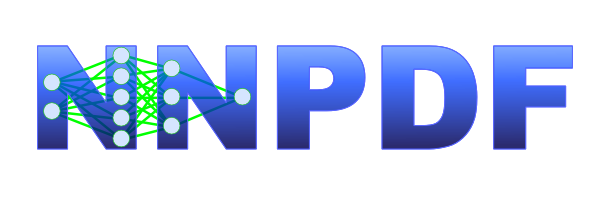

<div align="center">
  
</div>


[](https://zenodo.org/badge/latestdoi/118135201)

# NNPDF: An open-source machine learning framework for global analyses of parton distributions

[The NNPDF collaboration](http://nnpdf.science) determines the structure of the
proton using Machine Learning methods. This is the main repository of the
fitting and analysis frameworks. In particular it contains all the necessary
tools to [reproduce](https://docs.nnpdf.science/tutorials/reproduce.html) the
[NNPDF4.0 PDF determinations](https://arxiv.org/abs/2109.02653).

## Documentation

The documentation is available at <https://docs.nnpdf.science/>

## Install

See the [NNPDF installation
guide](https://docs.nnpdf.science/get-started/installation.html) for the 
conda package, and how to build from source.

Please note
that the [conda](https://docs.conda.io/en/latest/) based workflow described in
the documentation is the only supported one. While it may be possible to set up
the code in different ways, we won't be able to provide any assistance.

We follow a rolling development model where the tip of the master branch is 
expected to be stable, tested and correct. For more information see our 
[releases and compatibility policy](https://docs.nnpdf.science/releases.html).

## Cite

This code is described in the following [paper](https://inspirehep.net/literature?sort=mostrecent&size=25&page=1&q=find%20eprint%202109.02671):

```
@article{NNPDF:2021uiq,
    author = "Ball, Richard D. and others",
    collaboration = "NNPDF",
    title = "{An open-source machine learning framework for global analyses of parton distributions}",
    eprint = "2109.02671",
    archivePrefix = "arXiv",
    primaryClass = "hep-ph",
    reportNumber = "Edinburgh 2021/13, Nikhef-2021-020, TIF-UNIMI-2021-12",
    doi = "10.1140/epjc/s10052-021-09747-9",
    journal = "Eur. Phys. J. C",
    volume = "81",
    number = "10",
    pages = "958",
    year = "2021"
}
```

If you use the code to produce new results in a scientific publication, please
follow the [Citation Policy](https://docs.nnpdf.science/get-started/cite.html),
particularly in regards to the papers relevant for QCD NNLO and EW NLO
calculations incorporated in the NNPDF dataset.

## Contribute

We welcome bug reports or feature requests sent to the [issue
tracker](https://github.com/NNPDF/nnpdf/issues). You may use the issue tracker
for help and questions as well.

If you would like contribute to the code, please follow the [Contribution
Guidelines](https://docs.nnpdf.science/contributing/index.html).
