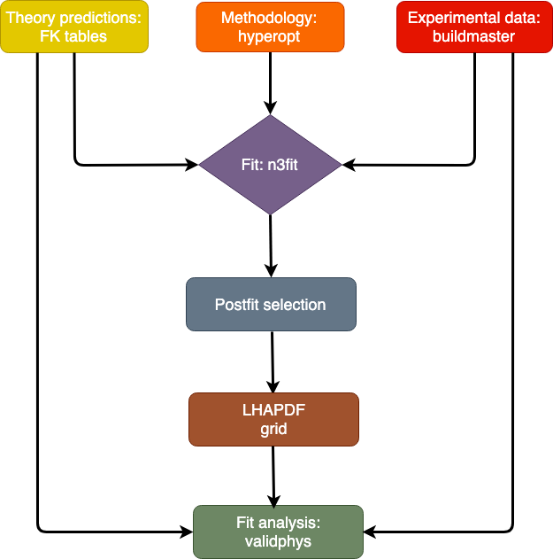

Code structure
================
Here, we describe the structure of the NNPDF code and we present a
high-level description of its functionalities. The workflow
for an NNPDF fit is displayed in the figure below.

    Code structure diagram

The :ref:`n3fit <n3fitindex>` fitting code
--------------------------------------------------------------------------------
This module implements the core fitting methodology as implemented through
the ``TensorFlow`` framework. The ``n3fit`` library allows
for a flexible specification of the neural network model adopted to
parametrise the PDFs, whose settings can be selected automatically via
the built-in :ref:`hyperoptimization algorithm <hyperoptimization>`. These
include the neural network type and architecture, the activation
functions, and the initialization strategy; the choice of optimizer and
of its corresponding parameters; and hyperparameters related to the
implementation in the fit of theoretical constraints such as PDF
positivity and integrability. The settings for a
PDF fit are inputted via a declarative runcard. Using these
settings, ``n3fit`` finds the values of the neural network parameters,
corresponding to the PDF at initial scale which describe the input data.
Following a post-fit selection (using the ``postfit`` tool implemented
in validphys) and PDF evolution step, the final output
consists of an `LHAPDF <https://lhapdf.hepforge.org/>`_ grid corresponding to
the best fit PDF as well as metadata on the fit performance.

The :ref:`validphys <vp-index>` analysis framework
--------------------------------------------------------------------------------
As an implementation of the
`reportengine <https://github.com/NNPDF/reportengine/>`_, it enables a workflow
focused on declarative and reproducible runcards. The code implements data
structures that can interact with those of ``libnnpdf`` and are accessible from
the runcard. The analysis code makes heavy use of common Python Data Science
libraries such as ``NumPy``, ``SciPy``, ``Matplotlib`` and ``Pandas``, and
through its use of ``Pandoc`` it is capable of outputting the final results to
HTML reports. These can be composed directly by the user or be generated by more
specialised, downstream applications. The package includes tools to interact
with online resources such as the results of fits or PDF grids, which, for
example, are automatically downloaded when they are required by a runcard.
