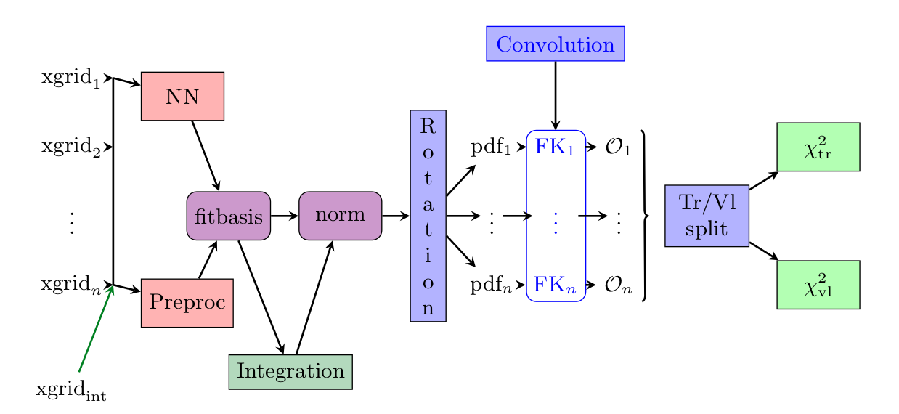
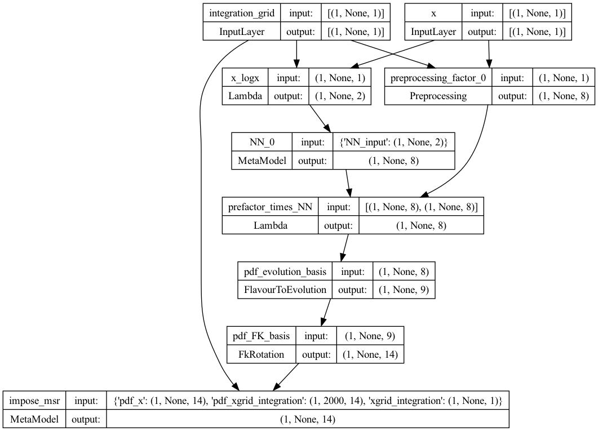
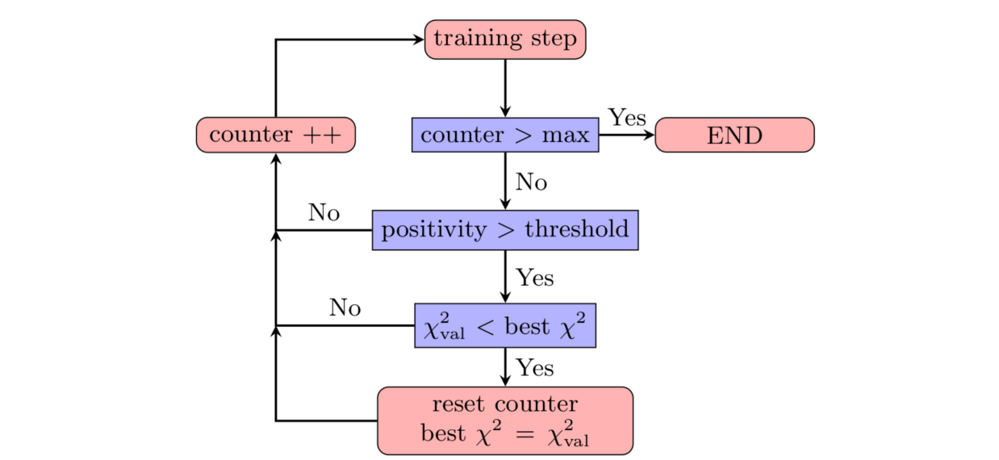
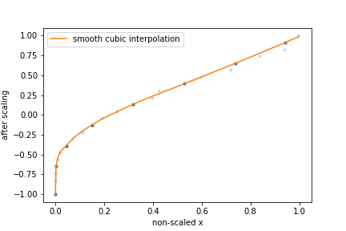

.. _methodology:

Methodology overview
====================

The goal of this document is to summarise from a conceptual point of view the main points which are
different in comparison to the latest NNPDF (i.e. `NNPDF3.1 <https://arxiv.org/abs/1706.00428>`_)
methodology.

.. warning::
   The default implementation of the concepts presented here are implemented with Keras and
   Tensorflow. The ``n3fit`` code inherits its features, so in this document we avoid the discussion of
   specific details which can be found in the `Keras documentation <https://keras.io/>`_.

.. note::
	The final setup used in ``n3fit`` fits can be extracted from the runcards stored in nnpdf/n3fit/runcards.

This document contains a more specific discussion about the choices currently implemented in the
``n3fit`` package and discussed for the first time in `hep-ph/1907.05075 <https://arxiv.org/abs/1907.05075>`_.

**Table of contents:**

.. toctree::

- :ref:`introduction`
- :ref:`neural-network-architecture`
- :ref:`preprocessing`
- :ref:`optimizer`
- :ref:`stopping`
- :ref:`positivity`
- :ref:`integrability`
- :ref:`Feature scaling<feature-scaling>`

.. _introduction:

Introduction
------------

The approach presented here inherits the technology developed by the NNPDF collaboration in terms
of fit pipeline but extends the possibility to test and improve fitting performance with modern
techniques inspired by the deep learning community.

The ``n3fit`` code is designed in python and replaces the ``nnfit`` program used in the NNPDF3.X family of fits.
It provides a simple abstraction layer which simplifies the life of developers when
considering the possibility of adding new fitting algorithms.

In the following table we list some of the differences between both codes:

+--------------------+---------------------------------+--------------------------------------------------+
| Component          | ``nnfit``                       | ``n3fit``                                        |
+====================+=================================+==================================================+
| Random numbers     | main seed, closure filter seed  | multi seed                                       |
+--------------------+---------------------------------+--------------------------------------------------+
| Data management    | libnnpdf                        | same as nnfit                                    |
+--------------------+---------------------------------+--------------------------------------------------+
| Neural net         | fixed architecture, per flavour |**single net, flexible architecture**             |
+--------------------+---------------------------------+--------------------------------------------------+
| Preprocessing      | random fixed                    | **fitted in range**                              |
+--------------------+---------------------------------+--------------------------------------------------+
| Integration        | a posteriori per iteration      | **built into in the model**                      |
+--------------------+---------------------------------+--------------------------------------------------+
| Optimizer          | genetic optimizer               | **gradient descent**                             |
+--------------------+---------------------------------+--------------------------------------------------+
| Stopping           | lookback                        | **patience**                                     |
+--------------------+---------------------------------+--------------------------------------------------+
| Positivity         | penalty and threshold           | **dynamic penalty, PDF must fulfill positivity** |
+--------------------+---------------------------------+--------------------------------------------------+
| Postfit            | 4-sigma chi2 and arclength      | same as nnfit                                    |
+--------------------+---------------------------------+--------------------------------------------------+
| Fine tuning        | manual                          | **semi-automatic**                               |
+--------------------+---------------------------------+--------------------------------------------------+
| Model selection    | closure test                    | closure test, **hyper optimization**             |
+--------------------+---------------------------------+--------------------------------------------------+
| Input scaling      | (x,log(x))                      | **feature scaling**                              |
+--------------------+---------------------------------+--------------------------------------------------+

In ``nnfit`` there is a single ``seed`` variable stored in the fit runcard which is used to
initialize an instance of the ``RandomGenerator`` class which provides random numbers sequentially.
The ``nnfit`` user has no independent control over the random number sequences used for the neural
network initialization, the training-validation split and the MC replica generation. On the other
hand, in ``n3fit`` we introduce three new seed variables in the fit runcard: ``trvlseed`` for the
random numbers used in training-validation, ``nnseed`` for the neural network initialization and
``mcseed`` which controls the MC replica generation.

.. note::
	In the next sections we focus on the ``n3fit`` specifics marked in **bold**.

.. _neural-network-architecture:

Neural network architecture
---------------------------

The main advantage of using a modern deep learning backend such as Keras/Tensorflow consists in the
possibility to change the neural network architecture quickly as the developer is not forced to fine
tune the code in order to achieve efficient memory management and PDF convolution performance.

The current ``n3fit`` code supports feed-forward multilayer perceptron neural networks (also known
as sequential dense networks in ML code frameworks) with custom number of layers, nodes, activation
functions and initializers from `Keras <https://keras.io/>`_.

A big difference in comparison to ``nnfit`` is the number of neural networks involved in the fit.
Here we use a **single neural network** model which maps the input (x, log x) to 8 outputs,
nominally they correspond exactly the 8 PDF flavours defined in NNPDF3.1. Note however that
``n3fit`` also allows for the use for one network per flavour by modifying the ``layer_type``
parameter.

Preprocessing has been modified from fixed random range selection to fitted preprocessing in a
**bounded range** by constraining the exponents to have the norm between a lower bound and an upper
bound. The preprocessing ranges are the same used in NNPDF3.1 and thus based on the evolution basis
with intrinsic charm.

The momentum sum rules are implemented as a **neural network layer** which computes the
normalization coefficients for each flavour. This layer approximates the integral with a sum over a
fixed grid of points in x. This approach guarantees that the model will always be normalized, even
if the network parameters are changed, and therefore the gradient descent updates are performed
correctly. The number and density of points in x is selected in such way that the final quality of
the integrals are at least permille level in comparison to 1D integration algorithms.

The network initialization relies on modern deep learning techniques such as glorot uniform and
normal (see `Keras initializers <https://keras.io/initializers/>`_), which have demonstrated to
provide a faster convergence to the solution.

.. important::
	Parameters like the number of layers, nodes, activation functions are hyper-parameters that require tuning.

To see the structure of the model, one can use Keras's ``plot_model`` function as illustrated in the script below.
See the `Keras documentation <https://www.tensorflow.org/api_docs/python/tf/keras/utils/plot_model>`_ for more details.

.. code-block:: python

   from tensorflow.keras.utils import plot_model
   from n3fit.model_gen import pdfNN_layer_generator
   from validphys.api import API

   fit_info = API.fit(fit="NNPDF40_nnlo_as_01180_1000").as_input()
   basis_info = fit_info["fitting"]["basis"]

   pdf_models = pdfNN_layer_generator(
       nodes=[25, 20, 8],
       activations=["tanh", "tanh", "linear"],
       initializer_name="glorot_normal",
       layer_type="dense",
       flav_info=basis_info,
       fitbasis="EVOL",
       out=14,
       seed=42,
       dropout=0.0,
       regularizer=None,
       regularizer_args=None,
       impose_sumrule="All",
       scaler=None,
       parallel_models=1,
   )

   pdf_model = pdf_models[0]
   nn_model = pdf_model.get_layer("NN_0")
   msr_model = pdf_model.get_layer("impose_msr")
   models_to_plot = {
           'plot_pdf': pdf_model,
           'plot_nn': nn_model,
           'plot_msr': msr_model
           }

   for name, model in models_to_plot.items():
       plot_model(model, to_file=f"./{name}.png", show_shapes=True)

This will produce for instance the plot of the PDF model below, and can also be used to plot the
neural network model, and the momentum sum rule model.

.. _preprocessing:

Preprocessing
-------------

Preprocessing has been modified from fixed random range selection to fitted preprocessing in a
**bounded range**. The preprocessing ranges are defined in the the same from NNPDF3.1 and are
defined in the ``fitting:basis`` parameter in the nnpdf runcard.

The old behaviour, in which the preprocessing is fixed randomly at the beginning of the fit, can be
recovered by setting the ``trainable`` flag to false. See the :ref:`detailed runcard guide<preprocessing-label>`
for more information on how to define the preprocessing.

.. _optimizer:

Optimizer
---------

In ``n3fit`` the genetic algorithm optimizer is replaced by modern stochastic gradient descent
algorithms such as RMS propagation, Adam, Adagrad, among others provided by `Keras <https://keras.io/>`_.
The development approach adopted in ``n3fit`` includes the abstraction of the optimization
algorithm thus the user has the possibility to extend it with new strategies. By default all
algorithms provided by Keras are available, other algorithms can be used by implementing them in the
appropiate backend.

Following the gradient descent approach the training is performed in iteration steps where:

- for each data point the neural network is evaluated (forward propagation)
- the accumulated errors of each parameter is computed using the backward propagation algorithm,
  where starting from the analytical gradient of the loss function as a function of the neural
  network parameters the errors for each parameter is estimated.
- each parameter is updated accordingly to its weight, the gradient direction and the gradient
  descent update scheme (which controls the convergence step size and speed).

The gradient descent schemes are usually controlled by the **learning rate**, and the total
**number of iterations**. Examples of fits using the ``n3fit`` methodology are available here:

- DIS-only fit based on NNPDF3.1 NNLO setup: `view <https://vp.nnpdf.science/KTzrle5FQGuuBdcigkDKnQ==/>`_
- Global fit based on NNPDF3.1 NNLO setup: `view <https://vp.nnpdf.science/qtXzt-BbQZGkV6P4pf9-UA==/>`_

.. important::
	The gradient descent scheme (RMSprop, Adagrad, etc.), the learning rate, the number of iteractions are hyper-parameters that require tuning.

.. _stopping:

Stopping algorithm
------------------

``n3fit`` implements a patience algorithm which, together with the :ref:`positivity <positivity>`
constraints, define when a fit is allowed to stop:

Following the diagram presented in the figure above, we then train the network until the validation
stops improving. From that point onwards, and to avoid false positives, we enable a patience
algorithm. This algorithm consists on waiting for a number of iterations before actually considering
the fit finished. This strategy avoids long fits by terminating the fitting at early stages thanks
to the patience tolerance.

If the patience is set to a ratio 1.0 (i.e., wait until all epochs are finished) this algorithm is
equal to that used in ``nnfit``.

The look-back approach implemented in ``nnfit`` is not required by ``n3fit`` due to its less
stochastic/random path towards the solution.

.. important::
	The patience and the lagrange multipliers are hyper-parameters of the fit which require specific fine tuning.

.. _positivity:

Positivity
----------

In NNPDF3.1 the positivity of a set of chosen DIS and fixed-target Drell-Yan processes was required:
PDFs were allowed to be negative, as long as these physical cross sections resulted to be positive.
Since :math:`\overline{MS}` `PDFs have been proved to be positive <https://inspirehep.net/files/7af2420c87dd87ad4fd5ac5ba0ee7e55>`_
it is now convenient to require positivity of the distributions :math:`q_k = \{u,\bar{u},d,\bar{d},s,\bar{s},g\}`
themselves. In ``n3fit`` this is done on the top of the DIS and Drell-Yan processes already
considered in ``nnfit``.

The implementation of such positivity constraints is based on a penalty term controlled by a
**positivity multiplier**: for each positivity observable :math:`\mathcal{O}_k` (which can now be
either a PDF or a physical cross section) we add to the total :math:`\chi^2` a term of the kind

.. math::
	\chi^2_{k,pos} = \Lambda_k \sum_i \Theta\left(-\mathcal{O}_k\left(x_i,Q^2\right)\right),

where :math:`\Lambda_k` is the Lagrange multiplier associated with the positivity observable
:math:`\mathcal{O}_k`. The points :math:`x_i` are chosen in the whole :math:`x`-region. More
precisely, they consist of 10 points logarithmically spaced between :math:`5 \times 10^{-7}` and
:math:`10^{-1}` and 10 points linearly spaced between 0.1 and 0.9. The scale at which positivity is
imposed is taken to be :math:`Q^2 = 5\,GeV^2`. During the minimization, fit solutions giving
negative values of :math:`\mathcal{O}_k` will receive a positive contribution to the total
:math:`\chi^2` and therefore will be penalized. A similar methodology was already used in ``nnfit``,
to impose positivity of DIS and Drell-Yan physical cross sections.

At the end of the fit, each ``n3fit`` replica is tagged with the flags ``POS_VETO`` or ``POS_PASS``,
according to whether or not each positivity penalty is greater than a given threshold, set equal to
:math:`10^{-6}` (note that the value of this threshold was set differently in ``nnfit``, where less
stringent positivity requirements were implemented). The :ref:`postfit selection<postfit>` only
accepts replicas which pass all positivity constraints, i.e., only replicas tagged as ``POS_PASS``
are retained.

Note as well that the positivity penalty in ``n3fit`` grows dynamically with the fit to facilitate
quick training at early stages of the fit.

.. _integrability:

Integrability
-------------
In order to satisfy valence and Gottfried sum rules, the distributions :math:`q_k = V,V_3,V_8, T_3, T_8`
have to be integrable at small-:math:`x`. This implies that

.. math::
 \lim_{x\rightarrow 0} x q_k\left(x,Q_0^2\right) = 0.

Similarly to what is done for positivity, we can impose this behaviour by adding an additional term
to the total :math:`\chi^2` which penalizes fit solutions where the integrable distributions do not
decrease to zero at small-:math:`x`. This term is

.. math::
 \chi^2_{k,integ} = \Lambda_k \sum_i \left[x_i q_k\left(x_i,Q^2\right)\right]^2.

The specific points :math:`x_i` used in this Lagrange multiplier term depend on the basis in which
the fit is performed: when working in the evolution basis, integrability is already imposed through
the choice of preprocessing exponents, and therefore a single small-:math:`x` point
:math:`x=10^{-9}` is used; when working in the flavour basis, no small-:math:`x` preprocessing term
is implemented, and therefore more stringent integrability conditions are used to enforce an
integrable small-:math:`x` behaviour. In particular, the three small-:math:`x` points
:math:`x_i = 10^{−5} , 10^{−4} , 10^{−3}` are used in the definition of the Lagrange multiplier
term above. After the fit, the ``postfit`` script will retain just those replicas satisfying a given
numerical definition of integrability, as documented in the :ref:`postfit <postfit-selection-criteria>`
section.

It should be noted that the positivity and integrability multipliers are hyper-parameters of the fit
which require specific fine tuning through :ref:`hyper-optimization <pos-int-hyperopt>`.

.. _feature-scaling:

Feature Scaling
---------------

Up to NNPDF4.0 the input to the neural network consisted of an input node ``(x)``, which in the
first layer is transformed to ``(x,log(x))`` before being connected to the trainable layers of the
network. The choice  for the ``(x,log(x))`` split is motivated by the fact that the pdfs appear to
scale linearly in the large-x region, which is roughly ``[1e-2,1]``, while the scaling is
logarithmic in the small-x region below ``x=1e-2``. However, gradient descent based optimizers are
incapable of distinguishing features across many orders of magnitude of ``x``, this choice of input
scaling means that the algorithm is limited to learning features on a logarithmic and linear scale.

To solve this problem there is the possibility to apply a different feature scaling to the input by
adding a ``interpolation_points: [number of points]`` flag to the ``n3fit`` runcard. By adding this
flag the ``(x,log(x))`` scaling is replaced by a scaling in such a way that all input ``x`` values
are evenly distributed on the domain ``[-1,1]``, and the input node is no longer split in two.

Of course this scaling is discrete while the pdfs must be continuous. Therefore a monotonically
increasing cubic spline is used to interpolate after the scaling has been applied. To this end the
`PchipInterpolator <https://docs.scipy.org/doc/scipy/reference/generated/scipy.interpolate.PchipInterpolator.html>`_
function from the scipy library is used. However, this way the neural network will be agnostic to
the existence of this interpolation function meaning it can no longer learn the true underlying law.
To fix this, the interpolation function has to be probed as well. This is done by only using
``[number of points]`` set by the ``interpolation_points`` flag to define the interpolation function
after the scaling has been applied. Using this methodology the points used in the interpolation are
again evenly distributed.

The figure above provides a schematic representation of this feature scaling methodology:

1. The input ``x`` are mapped onto the ``[-1,1]`` domain such that they are evenly distributed.
2. ``[number of points]`` points are kept (dark blue), while other points are discarded (light blue).
3. A cubic spline function is used to do the interpolation between the points that have not been
   discarded.
