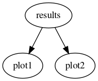
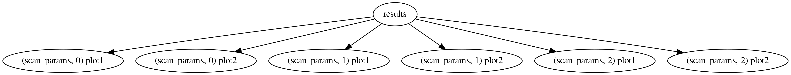
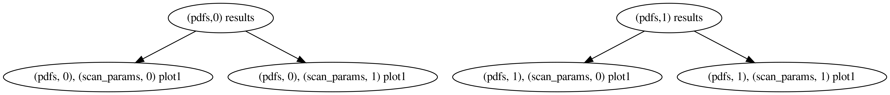

Resolving dependencies
======================

Dependencies are resolved automatically by `reportengine` when the
client applications follow a certain convention.

A few things that `validphys` needs to do are:

 - Provide a declarative interface where the user specifies only the
   amount of information needed to specify the requirements.

 - Be usable as a normal Python library.

 - Reuse the computations that are common to several actions.

In order to do all that, one declares "provider modules" (which is
done in `validphys.app`), which are nothing but normal Python files
containing functions (and thus can be used as a library). The
convention in `reportengine` is that a parameter with the same name as
a provider function specifies that that function is a dependency.

Imagine we want to have two plotting tools `plot1` and `plot2`, each
of which takes as an argument the result of the same computation,
`results`, which in turn need a PDF set entered by the user to be
computed. One would declare the functions as follows:

.. code:: python

	def results(pdf):
	    #Compute the results
		...

	def plot1(results):
	    #Take the result and produce a plot of type 1.
	    ...

	def plot2(results):
	    #Take the result and produce a plot of type 2.
	    ...

Then, an input card like the following:

.. code:: yaml

	pdf: NNPDF30_nlo_as_0118

	actions_:
	  - plot1
	  - plot2

would result in the following directed acyclic graph (or DAG):

The important point to note is that parameter names determine the
dependencies by default.

To address the inflexibility that results from the way we choose to
automatically assign dependencies, each action is assigned a unique
namespace specification. This allows one to
specify actions with several different parameters. Let's make the
example above more complicated:

.. code:: python

	def results(pdf):
	    #Compute the results
		...

	def plot1(results, parameter):
	    #Take the result and produce a plot of type 1.
	    ...

	def plot2(results, parameter):
	    #Take the result and produce a plot of type 2.
	    ...

We can request a parameter scan like this:

.. code:: yaml

	pdf: NNPDF30_nlo_as_0118

	scan_params:
	  - parameter: 5
	  - parameter: 10
	  - parameter: 20

	actions_:
	  - scan_params plot1
	  - scan_params plot2

which would result in the following computation:

We have requested the two plots to be computed once in each of the
three namespaces spanned by `scan_params`. The actions are in general
**not** computed in the requested namespace, but rather in the
*outermost one that satisfies all the dependencies* (there is also
a unique private stack frame per action not shown in the figures
above). That's why, in the graph above, `results` appears only once:
since it doesn't depend on the value of `parameter` (it doesn't appear
in its signature), it is computed in the root namespace, rather than
once in each of the `scan_params` namespaces. If we instead had this:

.. code:: yaml

	pdfs:
	 - NNPDF40_nnlo_as_01180
	 - CT14nlo

	scan_params:
	  - parameter: 5
	  - parameter: 10

	actions_:
	  - pdfs::scan_params plot1

The corresponding graph would be:

since `results` does depend on the pdf.
