%NNPDF report comparing Basic_runcard_bayesian and Basic_runcard_normal

Summary
-------

We are comparing:

  - Current Fit (`Basic_runcard_bayesian`): Basic runcard with extra options such as debugging and tensorboard
  - Reference Fit (`Basic_runcard_normal`): Basic runcard with extra options such as debugging and tensorboard

<table class="dataframe">
<thead>
<tr style="text-align: right;">
<th></th>
<th>Current Fit</th>
<th>Reference Fit</th>
</tr>
</thead>
<tbody>
<tr>
<th>$\chi^2$</th>
<td>0.91887</td>
<td>0.94843</td>
</tr>
<tr>
<th>$<E_{\mathrm{trn}}>$</th>
<td>0.91±0.14</td>
<td>1.90±0.12</td>
</tr>
<tr>
<th>$<E_{\mathrm{val}}>$</th>
<td>1.02±0.34</td>
<td>1.44±0.13</td>
</tr>
<tr>
<th>$<TL>$</th>
<td>450±280</td>
<td>300±110</td>
</tr>
<tr>
<th>$<\chi^2>$</th>
<td>0.934±0.029</td>
<td>1.067±0.060</td>
</tr>
<tr>
<th>$\phi$</th>
<td>0.122±0.068</td>
<td>0.344±0.051</td>
</tr>
</tbody>
</table>

t0 losses
---------
<table class="dataframe">
<thead>
<tr style="text-align: right;">
<th></th>
<th>Current Fit</th>
</tr>
</thead>
<tbody>
<tr>
<th>t0pdfset</th>
<td>NNPDF40_nnlo_as_01180</td>
</tr>
<tr>
<th>$\chi^2_{t0}$</th>
<td>0.91221</td>
</tr>
<tr>
<th>$<\chi^2_{t0}>$</th>
<td>0.929±0.025</td>
</tr>
</tbody>
</table>
<table class="dataframe">
<thead>
<tr style="text-align: right;">
<th></th>
<th>Reference Fit</th>
</tr>
</thead>
<tbody>
<tr>
<th>t0pdfset</th>
<td>NNPDF40_nnlo_as_01180</td>
</tr>
<tr>
<th>$\chi^2_{t0}$</th>
<td>0.95416</td>
</tr>
<tr>
<th>$<\chi^2_{t0}>$</th>
<td>1.076±0.057</td>
</tr>
</tbody>
</table>

Theory covariance summary
-------------------------
<table class="dataframe">
<thead>
<tr style="text-align: right;">
<th></th>
<th>Current Fit</th>
<th>Reference Fit</th>
</tr>
</thead>
<tbody>
<tr>
<th>sampling</th>
<td>False</td>
<td>False</td>
</tr>
<tr>
<th>fitting</th>
<td>False</td>
<td>False</td>
</tr>
<tr>
<th>validphys statistical estimators</th>
<td>False</td>
<td>False</td>
</tr>
</tbody>
</table>

Dataset properties
------------------
<table class="dataframe">
<thead>
<tr style="text-align: right;">
<th></th>
<th>Training fraction</th>
<th>Weight</th>
<th>C-factors</th>
<th>Other fields</th>
</tr>
<tr>
<th>Dataset</th>
<th></th>
<th></th>
<th></th>
<th></th>
</tr>
</thead>
<tbody>
<tr>
<th>NMC_NC_NOTFIXED_EM-F2</th>
<td>1</td>
<td>1</td>
<td>-</td>
<td>custom_group: unset, variant: ('legacy_dw',)</td>
</tr>
<tr>
<th>ATLAS_Z0J_8TEV_PT-M</th>
<td>1</td>
<td>1</td>
<td>-</td>
<td>custom_group: unset</td>
</tr>
</tbody>
</table>

Distances
---------

### Q = 1.65 GeV

#### Flavour basis, Log
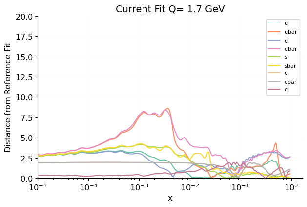 [.pdf](figures/Scales0_Normalize_Basespecs0_PDFscalespecs0_Distspecs0_plot_pdfdistances.pdf) [#](#Scales0_Normalize_Basespecs0_PDFscalespecs0_Distspecs0_plot_pdfdistances)](figures/Scales0_Normalize_Basespecs0_PDFscalespecs0_Distspecs0_plot_pdfdistances.png){#Scales0_Normalize_Basespecs0_PDFscalespecs0_Distspecs0_plot_pdfdistances} 

 [.pdf](figures/Scales0_Normalize_Basespecs0_PDFscalespecs0_Distspecs0_plot_pdfvardistances.pdf) [#](#Scales0_Normalize_Basespecs0_PDFscalespecs0_Distspecs0_plot_pdfvardistances)](figures/Scales0_Normalize_Basespecs0_PDFscalespecs0_Distspecs0_plot_pdfvardistances.png){#Scales0_Normalize_Basespecs0_PDFscalespecs0_Distspecs0_plot_pdfvardistances} 

#### Flavour basis, Linear
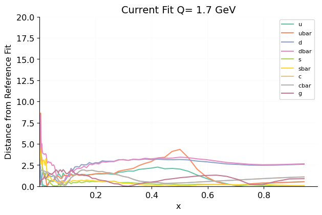 [.pdf](figures/Scales0_Normalize_Basespecs0_PDFscalespecs1_Distspecs0_plot_pdfdistances.pdf) [#](#Scales0_Normalize_Basespecs0_PDFscalespecs1_Distspecs0_plot_pdfdistances)](figures/Scales0_Normalize_Basespecs0_PDFscalespecs1_Distspecs0_plot_pdfdistances.png){#Scales0_Normalize_Basespecs0_PDFscalespecs1_Distspecs0_plot_pdfdistances} 

 [.pdf](figures/Scales0_Normalize_Basespecs0_PDFscalespecs1_Distspecs0_plot_pdfvardistances.pdf) [#](#Scales0_Normalize_Basespecs0_PDFscalespecs1_Distspecs0_plot_pdfvardistances)](figures/Scales0_Normalize_Basespecs0_PDFscalespecs1_Distspecs0_plot_pdfvardistances.png){#Scales0_Normalize_Basespecs0_PDFscalespecs1_Distspecs0_plot_pdfvardistances} 

#### Evolution basis, Log
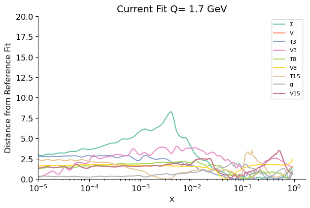 [.pdf](figures/Scales0_Normalize_Basespecs1_PDFscalespecs0_Distspecs0_plot_pdfdistances.pdf) [#](#Scales0_Normalize_Basespecs1_PDFscalespecs0_Distspecs0_plot_pdfdistances)](figures/Scales0_Normalize_Basespecs1_PDFscalespecs0_Distspecs0_plot_pdfdistances.png){#Scales0_Normalize_Basespecs1_PDFscalespecs0_Distspecs0_plot_pdfdistances} 

 [.pdf](figures/Scales0_Normalize_Basespecs1_PDFscalespecs0_Distspecs0_plot_pdfvardistances.pdf) [#](#Scales0_Normalize_Basespecs1_PDFscalespecs0_Distspecs0_plot_pdfvardistances)](figures/Scales0_Normalize_Basespecs1_PDFscalespecs0_Distspecs0_plot_pdfvardistances.png){#Scales0_Normalize_Basespecs1_PDFscalespecs0_Distspecs0_plot_pdfvardistances} 

#### Evolution basis, Linear
 [.pdf](figures/Scales0_Normalize_Basespecs1_PDFscalespecs1_Distspecs0_plot_pdfdistances.pdf) [#](#Scales0_Normalize_Basespecs1_PDFscalespecs1_Distspecs0_plot_pdfdistances)](figures/Scales0_Normalize_Basespecs1_PDFscalespecs1_Distspecs0_plot_pdfdistances.png){#Scales0_Normalize_Basespecs1_PDFscalespecs1_Distspecs0_plot_pdfdistances} 

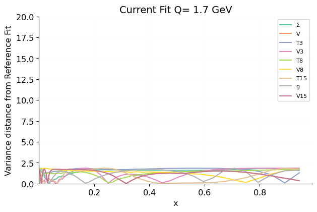 [.pdf](figures/Scales0_Normalize_Basespecs1_PDFscalespecs1_Distspecs0_plot_pdfvardistances.pdf) [#](#Scales0_Normalize_Basespecs1_PDFscalespecs1_Distspecs0_plot_pdfvardistances)](figures/Scales0_Normalize_Basespecs1_PDFscalespecs1_Distspecs0_plot_pdfvardistances.png){#Scales0_Normalize_Basespecs1_PDFscalespecs1_Distspecs0_plot_pdfvardistances} 

### Q = 100 GeV

#### Flavour basis, Log
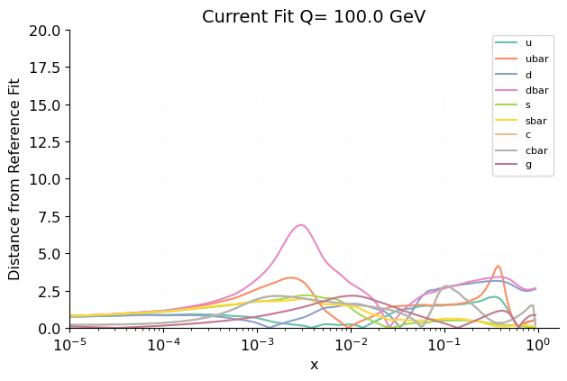 [.pdf](figures/Scales1_Normalize_Basespecs0_PDFscalespecs0_Distspecs0_plot_pdfdistances.pdf) [#](#Scales1_Normalize_Basespecs0_PDFscalespecs0_Distspecs0_plot_pdfdistances)](figures/Scales1_Normalize_Basespecs0_PDFscalespecs0_Distspecs0_plot_pdfdistances.png){#Scales1_Normalize_Basespecs0_PDFscalespecs0_Distspecs0_plot_pdfdistances} 

 [.pdf](figures/Scales1_Normalize_Basespecs0_PDFscalespecs0_Distspecs0_plot_pdfvardistances.pdf) [#](#Scales1_Normalize_Basespecs0_PDFscalespecs0_Distspecs0_plot_pdfvardistances)](figures/Scales1_Normalize_Basespecs0_PDFscalespecs0_Distspecs0_plot_pdfvardistances.png){#Scales1_Normalize_Basespecs0_PDFscalespecs0_Distspecs0_plot_pdfvardistances} 

#### Flavour basis, Linear
 [.pdf](figures/Scales1_Normalize_Basespecs0_PDFscalespecs1_Distspecs0_plot_pdfdistances.pdf) [#](#Scales1_Normalize_Basespecs0_PDFscalespecs1_Distspecs0_plot_pdfdistances)](figures/Scales1_Normalize_Basespecs0_PDFscalespecs1_Distspecs0_plot_pdfdistances.png){#Scales1_Normalize_Basespecs0_PDFscalespecs1_Distspecs0_plot_pdfdistances} 

 [.pdf](figures/Scales1_Normalize_Basespecs0_PDFscalespecs1_Distspecs0_plot_pdfvardistances.pdf) [#](#Scales1_Normalize_Basespecs0_PDFscalespecs1_Distspecs0_plot_pdfvardistances)](figures/Scales1_Normalize_Basespecs0_PDFscalespecs1_Distspecs0_plot_pdfvardistances.png){#Scales1_Normalize_Basespecs0_PDFscalespecs1_Distspecs0_plot_pdfvardistances} 

#### Evolution basis, Log
 [.pdf](figures/Scales1_Normalize_Basespecs1_PDFscalespecs0_Distspecs0_plot_pdfdistances.pdf) [#](#Scales1_Normalize_Basespecs1_PDFscalespecs0_Distspecs0_plot_pdfdistances)](figures/Scales1_Normalize_Basespecs1_PDFscalespecs0_Distspecs0_plot_pdfdistances.png){#Scales1_Normalize_Basespecs1_PDFscalespecs0_Distspecs0_plot_pdfdistances} 

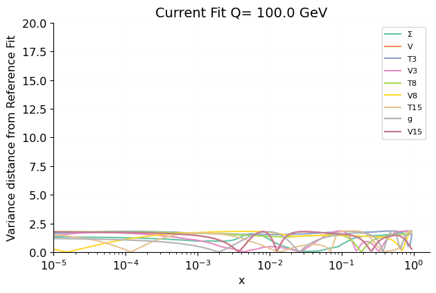 [.pdf](figures/Scales1_Normalize_Basespecs1_PDFscalespecs0_Distspecs0_plot_pdfvardistances.pdf) [#](#Scales1_Normalize_Basespecs1_PDFscalespecs0_Distspecs0_plot_pdfvardistances)](figures/Scales1_Normalize_Basespecs1_PDFscalespecs0_Distspecs0_plot_pdfvardistances.png){#Scales1_Normalize_Basespecs1_PDFscalespecs0_Distspecs0_plot_pdfvardistances} 

#### Evolution basis, Linear
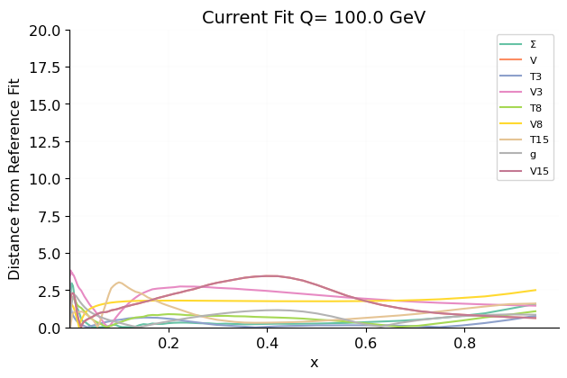 [.pdf](figures/Scales1_Normalize_Basespecs1_PDFscalespecs1_Distspecs0_plot_pdfdistances.pdf) [#](#Scales1_Normalize_Basespecs1_PDFscalespecs1_Distspecs0_plot_pdfdistances)](figures/Scales1_Normalize_Basespecs1_PDFscalespecs1_Distspecs0_plot_pdfdistances.png){#Scales1_Normalize_Basespecs1_PDFscalespecs1_Distspecs0_plot_pdfdistances} 

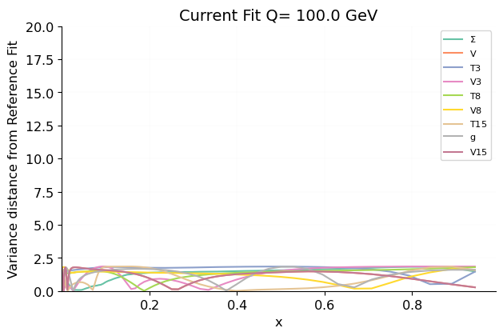 [.pdf](figures/Scales1_Normalize_Basespecs1_PDFscalespecs1_Distspecs0_plot_pdfvardistances.pdf) [#](#Scales1_Normalize_Basespecs1_PDFscalespecs1_Distspecs0_plot_pdfvardistances)](figures/Scales1_Normalize_Basespecs1_PDFscalespecs1_Distspecs0_plot_pdfvardistances.png){#Scales1_Normalize_Basespecs1_PDFscalespecs1_Distspecs0_plot_pdfvardistances} 

PDF arc-lengths
---------------
 [.pdf](figures/Basespecs0_plot_arc_lengths.pdf) [#](#Basespecs0_plot_arc_lengths)](figures/Basespecs0_plot_arc_lengths.png){#Basespecs0_plot_arc_lengths} 

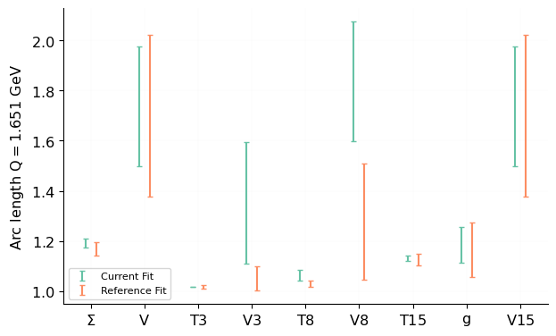 [.pdf](figures/Basespecs1_plot_arc_lengths.pdf) [#](#Basespecs1_plot_arc_lengths)](figures/Basespecs1_plot_arc_lengths.png){#Basespecs1_plot_arc_lengths} 

Sum rules
---------

### Current Fit

#### Known sum rules

<table class="dataframe">
<thead>
<tr style="text-align: right;">
<th></th>
<th>mean</th>
<th>std</th>
<th>min</th>
<th>max</th>
</tr>
</thead>
<tbody>
<tr>
<th>momentum</th>
<td>1.001</td>
<td>3.132E-4</td>
<td>1.000</td>
<td>1.001</td>
</tr>
<tr>
<th>uvalence</th>
<td>2.004</td>
<td>5.166E-3</td>
<td>1.997</td>
<td>2.009</td>
</tr>
<tr>
<th>dvalence</th>
<td>0.9993</td>
<td>7.937E-3</td>
<td>0.9881</td>
<td>1.005</td>
</tr>
<tr>
<th>svalence</th>
<td>-1.099E-2</td>
<td>1.412E-2</td>
<td>-2.447E-2</td>
<td>8.512E-3</td>
</tr>
<tr>
<th>cvalence</th>
<td>-7.260E-8</td>
<td>6.127E-8</td>
<td>-1.483E-7</td>
<td>-7.566E-9</td>
</tr>
</tbody>
</table>

#### Unknown sum rules

<table class="dataframe">
<thead>
<tr style="text-align: right;">
<th></th>
<th>mean</th>
<th>std</th>
</tr>
</thead>
<tbody>
<tr>
<th>u momentum fraction</th>
<td>0.229</td>
<td>0.046</td>
</tr>
<tr>
<th>ubar momentum fraction</th>
<td>0.053</td>
<td>0.032</td>
</tr>
<tr>
<th>d momentum fraction</th>
<td>0.01</td>
<td>0.11</td>
</tr>
<tr>
<th>dbar momentum fraction</th>
<td>0.127</td>
<td>0.096</td>
</tr>
<tr>
<th>s momentum fraction</th>
<td>0.104</td>
<td>0.068</td>
</tr>
<tr>
<th>sbar momentum fraction</th>
<td>0.006</td>
<td>0.053</td>
</tr>
<tr>
<th>cp momentum fraction</th>
<td>0.0452</td>
<td>0.0076</td>
</tr>
<tr>
<th>cm momentum fraction</th>
<td>-2.6E-8</td>
<td>3.3E-8</td>
</tr>
<tr>
<th>g momentum fraction</th>
<td>0.424</td>
<td>0.038</td>
</tr>
<tr>
<th>T3</th>
<td>0.718</td>
<td>0.030</td>
</tr>
<tr>
<th>T8</th>
<td>4.34</td>
<td>0.49</td>
</tr>
</tbody>
</table>

### Reference Fit

#### Known sum rules

<table class="dataframe">
<thead>
<tr style="text-align: right;">
<th></th>
<th>mean</th>
<th>std</th>
<th>min</th>
<th>max</th>
</tr>
</thead>
<tbody>
<tr>
<th>momentum</th>
<td>1.000</td>
<td>5.709E-6</td>
<td>1.000</td>
<td>1.000</td>
</tr>
<tr>
<th>uvalence</th>
<td>2.000</td>
<td>3.157E-7</td>
<td>2.000</td>
<td>2.000</td>
</tr>
<tr>
<th>dvalence</th>
<td>1.000</td>
<td>3.647E-6</td>
<td>1.000</td>
<td>1.000</td>
</tr>
<tr>
<th>svalence</th>
<td>1.106E-6</td>
<td>3.348E-5</td>
<td>-3.946E-5</td>
<td>4.254E-5</td>
</tr>
<tr>
<th>cvalence</th>
<td>-7.530E-9</td>
<td>2.742E-8</td>
<td>-1.891E-8</td>
<td>4.025E-8</td>
</tr>
</tbody>
</table>

#### Unknown sum rules

<table class="dataframe">
<thead>
<tr style="text-align: right;">
<th></th>
<th>mean</th>
<th>std</th>
</tr>
</thead>
<tbody>
<tr>
<th>u momentum fraction</th>
<td>0.304</td>
<td>0.055</td>
</tr>
<tr>
<th>ubar momentum fraction</th>
<td>-0.012</td>
<td>0.013</td>
</tr>
<tr>
<th>d momentum fraction</th>
<td>0.210</td>
<td>0.018</td>
</tr>
<tr>
<th>dbar momentum fraction</th>
<td>-0.057</td>
<td>0.025</td>
</tr>
<tr>
<th>s momentum fraction</th>
<td>0.084</td>
<td>0.069</td>
</tr>
<tr>
<th>sbar momentum fraction</th>
<td>0.031</td>
<td>0.083</td>
</tr>
<tr>
<th>cp momentum fraction</th>
<td>0.0405</td>
<td>0.0020</td>
</tr>
<tr>
<th>cm momentum fraction</th>
<td>-1.06E-7</td>
<td>3.1E-8</td>
</tr>
<tr>
<th>g momentum fraction</th>
<td>0.400</td>
<td>0.081</td>
</tr>
<tr>
<th>T3</th>
<td>0.73</td>
<td>0.15</td>
</tr>
<tr>
<th>T8</th>
<td>2.3</td>
<td>2.4</td>
</tr>
</tbody>
</table>

PDF plots
---------

[Plots at Q = 1.65 GeV](Scales0_pdf_report_report.html)

[Plots at Q = 100 GeV](Scales1_pdf_report_report.html)

Luminosities
------------

[Plots at 13 TeV](Energies0_lumi_report_report.html)

Effective exponents
-------------------
[Detailed information](exponents_report_report.html)

Training lengths
----------------
 [.pdf](figures/CurrentFit_plot_training_length.pdf) [#](#CurrentFit_plot_training_length)](figures/CurrentFit_plot_training_length.png){#CurrentFit_plot_training_length} 

 [.pdf](figures/ReferenceFit_plot_training_length.pdf) [#](#ReferenceFit_plot_training_length)](figures/ReferenceFit_plot_training_length.png){#ReferenceFit_plot_training_length} 

Training-validation
-------------------
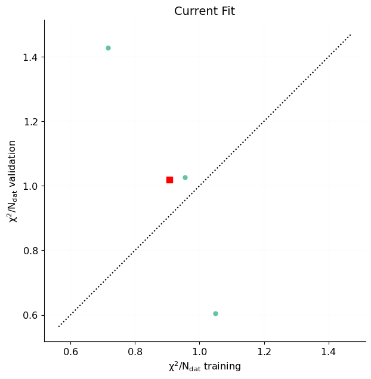 [.pdf](figures/CurrentFit_plot_training_validation.pdf) [#](#CurrentFit_plot_training_validation)](figures/CurrentFit_plot_training_validation.png){#CurrentFit_plot_training_validation} 

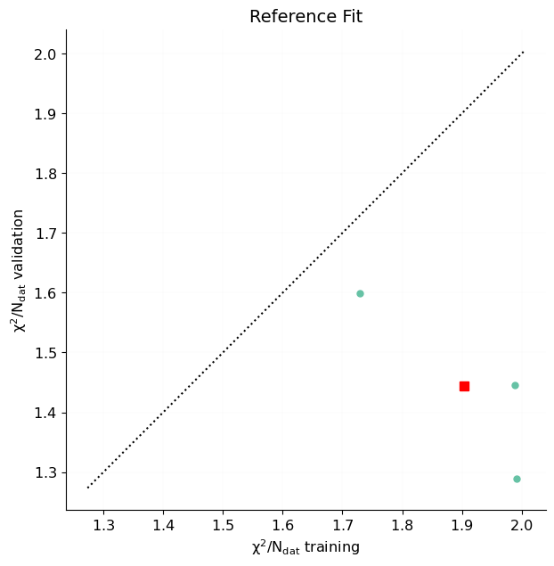 [.pdf](figures/ReferenceFit_plot_training_validation.pdf) [#](#ReferenceFit_plot_training_validation)](figures/ReferenceFit_plot_training_validation.png){#ReferenceFit_plot_training_validation} 

$\chi^2$ by nnpdf31_process
----------------------------------------
 [.pdf](figures/DataGroups0_plot_fits_groups_data_chi2.pdf) [#](#DataGroups0_plot_fits_groups_data_chi2)](figures/DataGroups0_plot_fits_groups_data_chi2.png){#DataGroups0_plot_fits_groups_data_chi2} 

$\chi^2$ by experiment
----------------------------------------
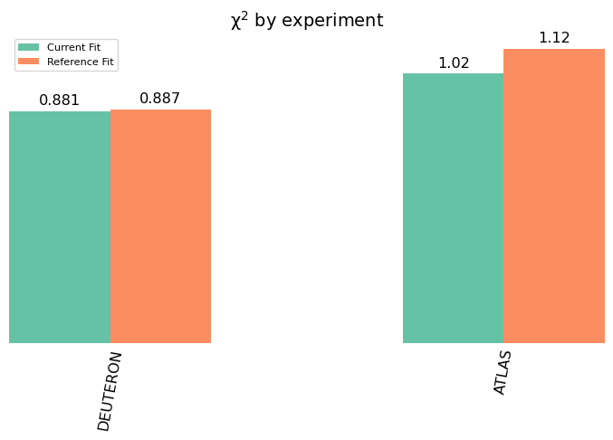 [.pdf](figures/DataGroups1_plot_fits_groups_data_chi2.pdf) [#](#DataGroups1_plot_fits_groups_data_chi2)](figures/DataGroups1_plot_fits_groups_data_chi2.png){#DataGroups1_plot_fits_groups_data_chi2} 

$\chi^2$ by dataset
-------------------
### Plot
 [.pdf](figures/plot_fits_datasets_chi2.pdf) [#](#plot_fits_datasets_chi2)](figures/plot_fits_datasets_chi2.png){#plot_fits_datasets_chi2} 

### Table
<table class="dataframe">
<thead>
<tr>
<th></th>
<th></th>
<th colspan="2" halign="left">Current Fit</th>
<th colspan="2" halign="left">Reference Fit</th>
</tr>
<tr>
<th></th>
<th></th>
<th>ndata</th>
<th>$\chi^2/ndata$</th>
<th>ndata</th>
<th>$\chi^2/ndata$</th>
</tr>
</thead>
<tbody>
<tr>
<th rowspan="3" valign="top">ALL</th>
<th>Total</th>
<td>165</td>
<td>0.9189</td>
<td>165</td>
<td>0.9484</td>
</tr>
<tr>
<th>NMC_NC_NOTFIXED_EM-F2</th>
<td>121</td>
<td>0.8811</td>
<td>121</td>
<td>0.8871</td>
</tr>
<tr>
<th>ATLAS_Z0J_8TEV_PT-M</th>
<td>44</td>
<td>1.023</td>
<td>44</td>
<td>1.117</td>
</tr>
<tr>
<th>Total</th>
<th>Total</th>
<td>165</td>
<td>0.9189</td>
<td>165</td>
<td>0.9484</td>
</tr>
</tbody>
</table>

$\phi$ by nnpdf31_process
--------------------------------------
 [.pdf](figures/DataGroups0_plot_fits_groups_data_phi.pdf) [#](#DataGroups0_plot_fits_groups_data_phi)](figures/DataGroups0_plot_fits_groups_data_phi.png){#DataGroups0_plot_fits_groups_data_phi} 

$\phi$ by experiment
--------------------------------------
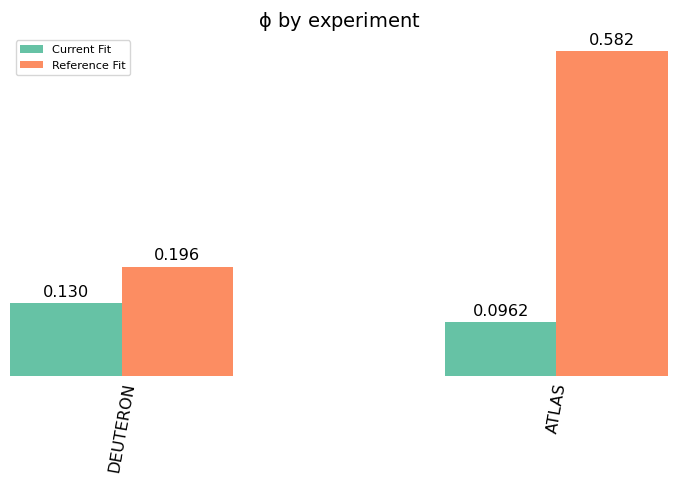 [.pdf](figures/DataGroups1_plot_fits_groups_data_phi.pdf) [#](#DataGroups1_plot_fits_groups_data_phi)](figures/DataGroups1_plot_fits_groups_data_phi.png){#DataGroups1_plot_fits_groups_data_phi} 

Dataset plots
-------------

[Plots for NMC_NC_NOTFIXED_EM-F2](matched_datasets_from_dataspecs0_dataset_report_report.html)

[Plots for ATLAS_Z0J_8TEV_PT-M](matched_datasets_from_dataspecs1_dataset_report_report.html)

Positivity
----------

Dataset differences and cuts
----------------------------
The following datasets are included in both `Current Fit` and `Reference Fit`:

 - ATLAS $Z$ $p_T$ 8 TeV $(p_T^{ll},M_{ll})$ (`ATLAS_Z0J_8TEV_PT-M`)
 - NMC $d/p$ (`NMC_NC_NOTFIXED_EM-F2`)

The theories used in the fits are identical (theoryid=41000000)

Code versions
-------------
<table class="dataframe">
<thead>
<tr style="text-align: right;">
<th></th>
<th>Basic_runcard_bayesian</th>
<th>Basic_runcard_normal</th>
</tr>
<tr>
<th>module</th>
<th></th>
<th></th>
</tr>
</thead>
<tbody>
<tr>
<th>keras</th>
<td>3.12.0 backend='tensorflow'</td>
<td>3.12.0 backend='tensorflow'</td>
</tr>
<tr>
<th>tensorflow</th>
<td>2.18.0</td>
<td>2.18.0</td>
</tr>
<tr>
<th>numpy</th>
<td>2.2.6</td>
<td>2.2.6</td>
</tr>
<tr>
<th>nnpdf</th>
<td>4.1.2</td>
<td>4.1.2</td>
</tr>
<tr>
<th>validphys</th>
<td>4.1.2</td>
<td>4.1.2</td>
</tr>
</tbody>
</table>