ATLASLOMASSDY11
===============
#### Plot vs Datapoint 
[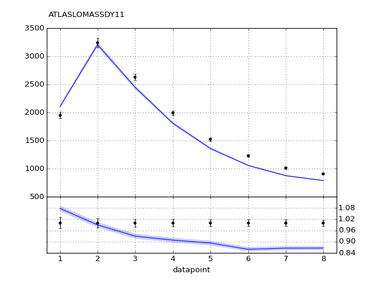](ATLASLOMASSDY11.pdf) 

[Return to Index](../index.html)

------------- 
#### Plot vs Kinematics (collated bins) 
###### n.b bins are scaled by a factor of 2^i where i is the bin index  
[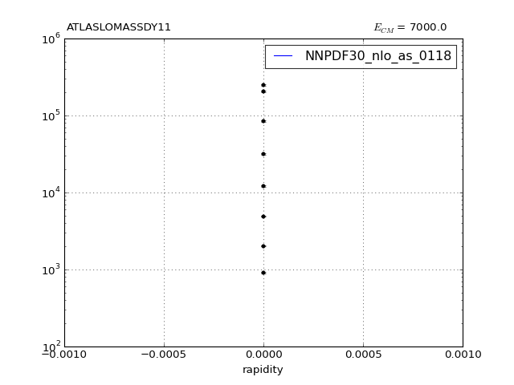](ATLASLOMASSDY11_0.pdf)
      
[Return to Index](../index.html)

------------- 
#### Ratio plot vs Kinematics (collated bins) 
[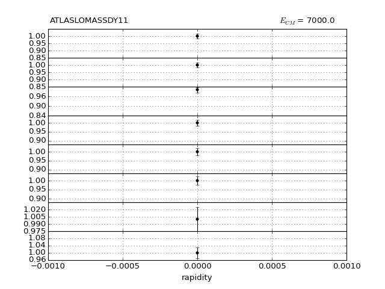](ATLASLOMASSDY11_0_R.pdf)
      
[Return to Index](../index.html)

------------- 
#### Plot vs Kinematics (individual bins) 
[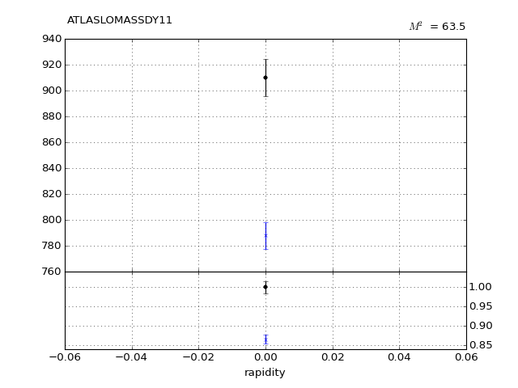](ATLASLOMASSDY11_0_0.pdf)
[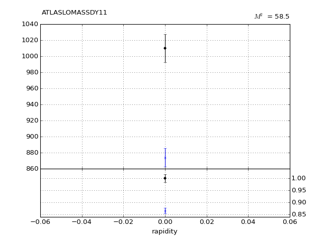](ATLASLOMASSDY11_1_0.pdf)
[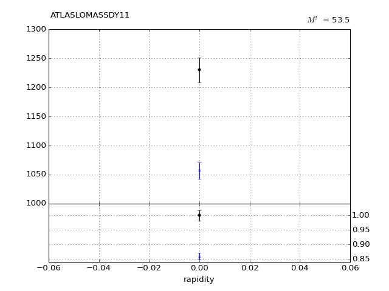](ATLASLOMASSDY11_2_0.pdf)
[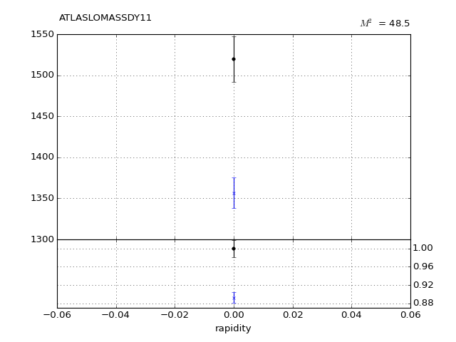](ATLASLOMASSDY11_3_0.pdf)
[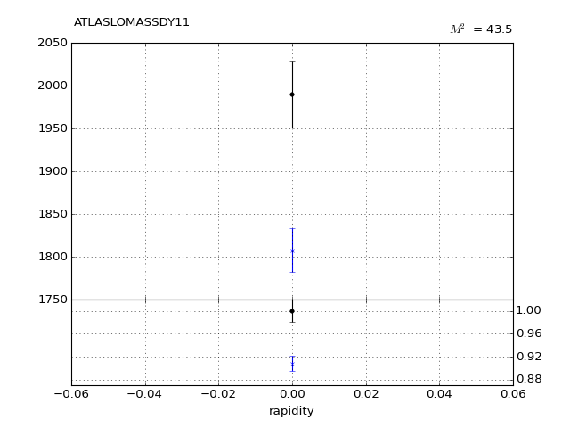](ATLASLOMASSDY11_4_0.pdf)
[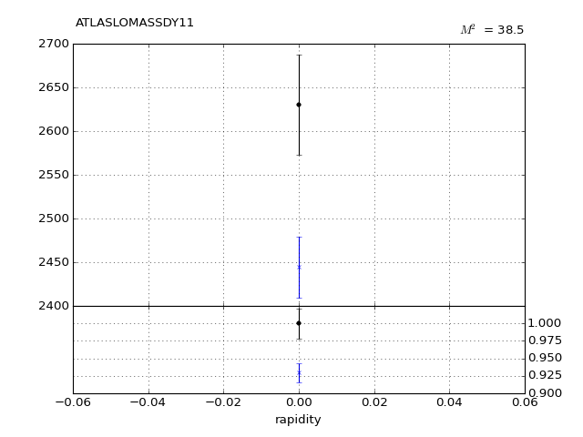](ATLASLOMASSDY11_5_0.pdf)
[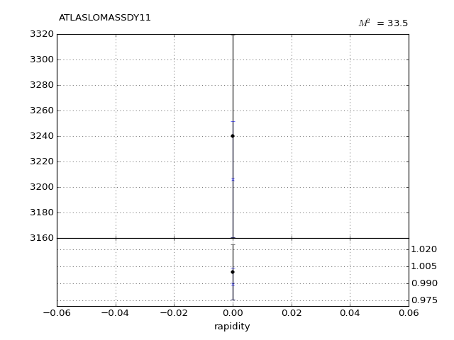](ATLASLOMASSDY11_6_0.pdf)
[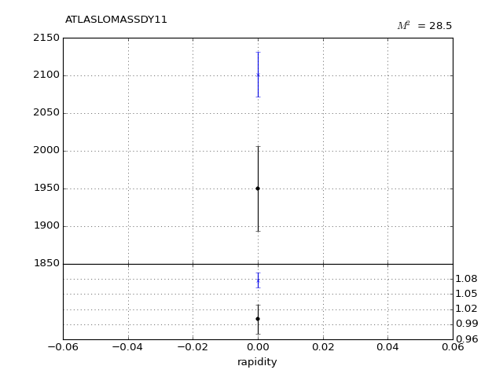](ATLASLOMASSDY11_7_0.pdf)
      
[Return to Index](../index.html)

------------- 
