H1HERA2HGHY
===========
#### Plot vs Datapoint 
[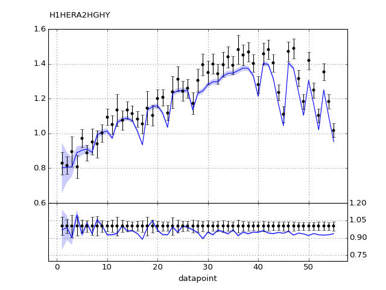](H1HERA2HGHY.pdf) 

[Return to Index](../index.html)

------------- 
#### Plot vs Kinematics (collated bins) 
###### n.b bins are scaled by a factor of 2^i where i is the bin index  
[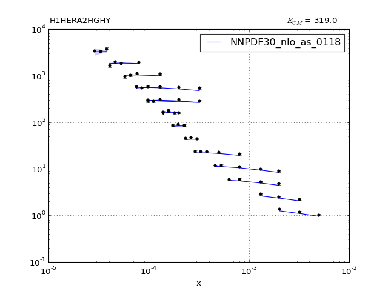](H1HERA2HGHY_0.pdf)
      
[Return to Index](../index.html)

------------- 
#### Ratio plot vs Kinematics (collated bins) 
[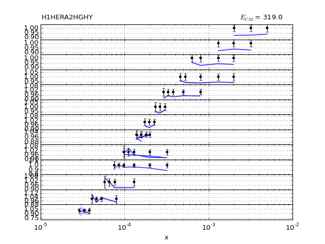](H1HERA2HGHY_0_R.pdf)
      
[Return to Index](../index.html)

------------- 
#### Plot vs Kinematics (individual bins) 
[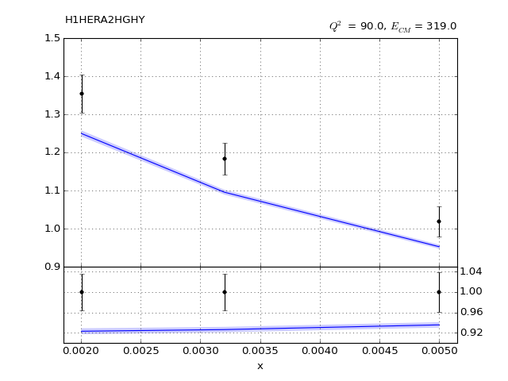](H1HERA2HGHY_0_0.pdf)
[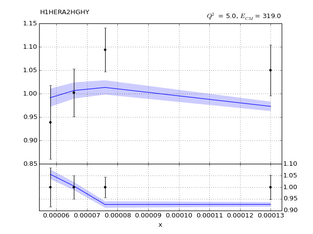](H1HERA2HGHY_10_0.pdf)
[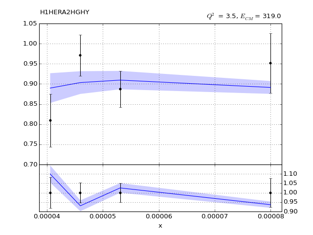](H1HERA2HGHY_11_0.pdf)
[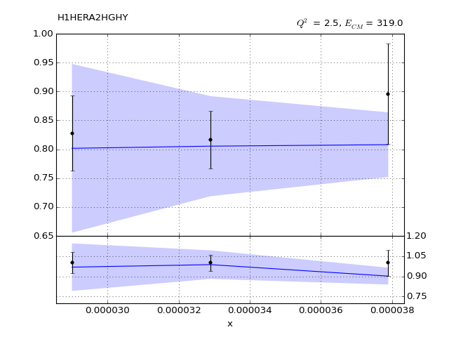](H1HERA2HGHY_12_0.pdf)
[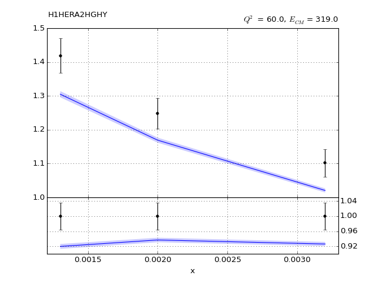](H1HERA2HGHY_1_0.pdf)
[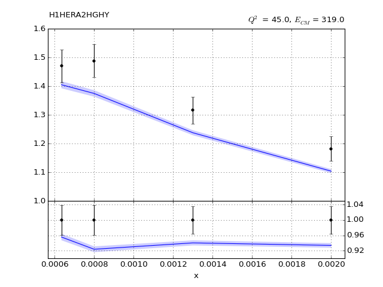](H1HERA2HGHY_2_0.pdf)
[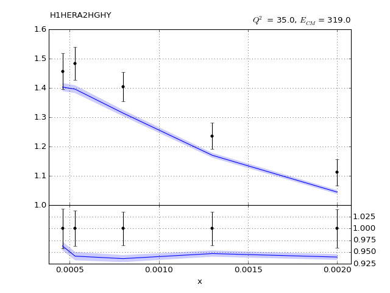](H1HERA2HGHY_3_0.pdf)
[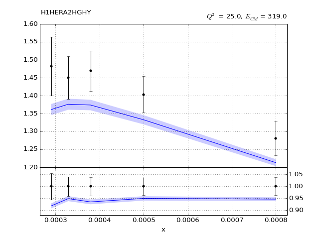](H1HERA2HGHY_4_0.pdf)
[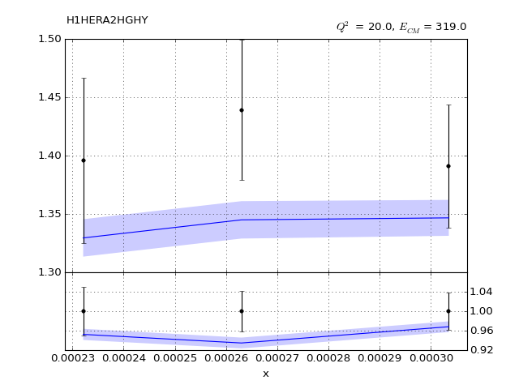](H1HERA2HGHY_5_0.pdf)
[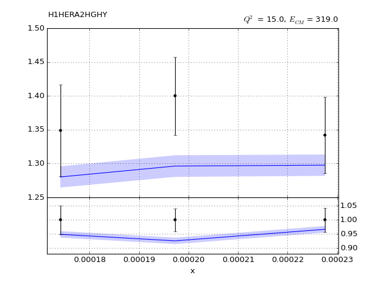](H1HERA2HGHY_6_0.pdf)
[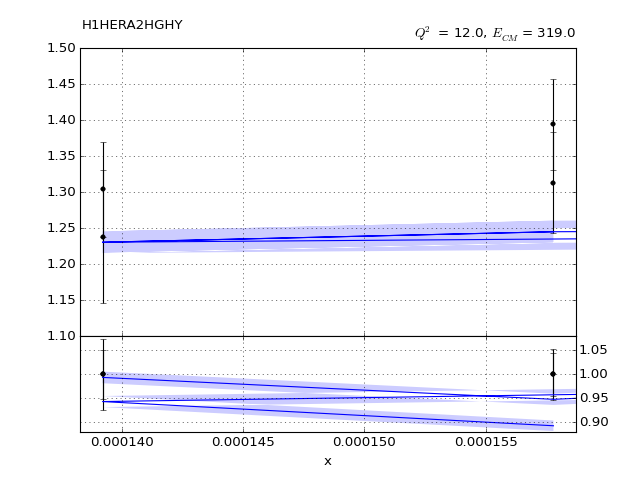](H1HERA2HGHY_7_0.pdf)
[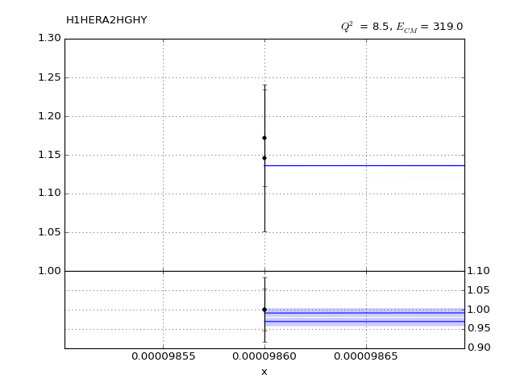](H1HERA2HGHY_8_0.pdf)

      
[Return to Index](../index.html)

------------- 
