H1HERA2NCEM
===========
#### Plot vs Datapoint 
[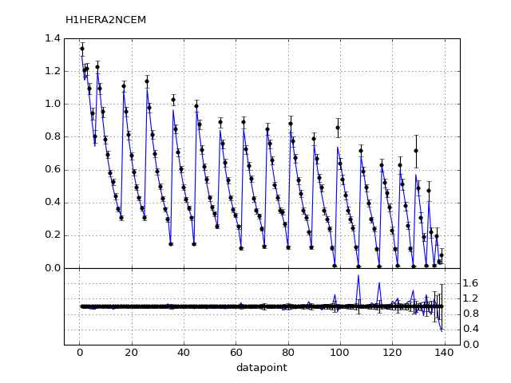](H1HERA2NCEM.pdf) 

[Return to Index](../index.html)

------------- 
#### Plot vs Kinematics (collated bins) 
###### n.b bins are scaled by a factor of 2^i where i is the bin index  
[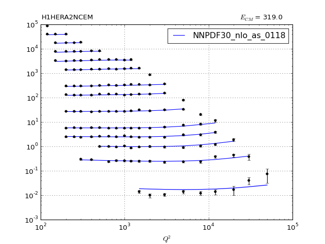](H1HERA2NCEM_0.pdf)
      
[Return to Index](../index.html)

------------- 
#### Ratio plot vs Kinematics (collated bins) 
[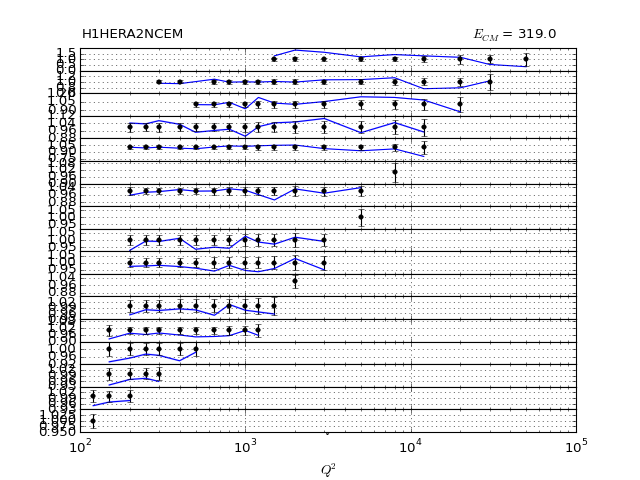](H1HERA2NCEM_0_R.pdf)
      
[Return to Index](../index.html)

------------- 
#### Plot vs Kinematics (individual bins) 
[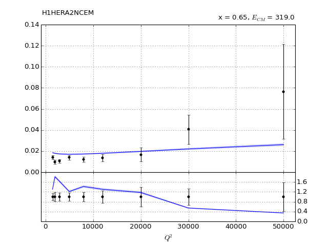](H1HERA2NCEM_0_0.pdf)
[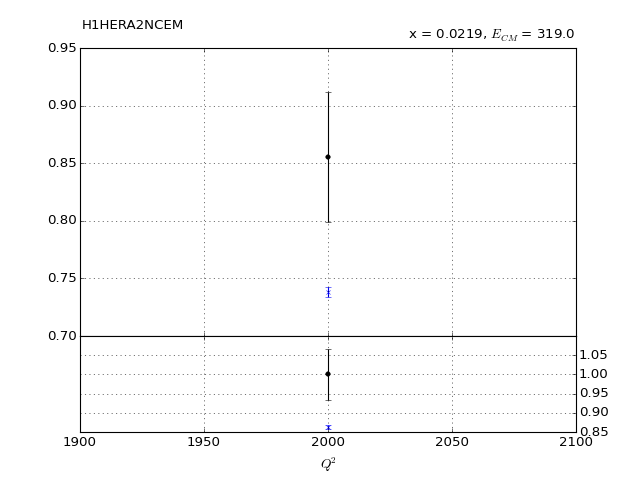](H1HERA2NCEM_10_0.pdf)
[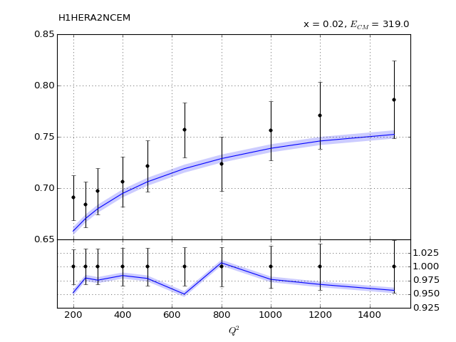](H1HERA2NCEM_11_0.pdf)
[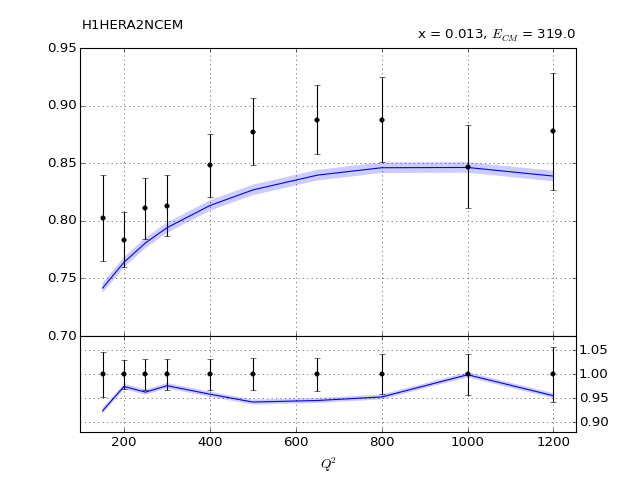](H1HERA2NCEM_12_0.pdf)
[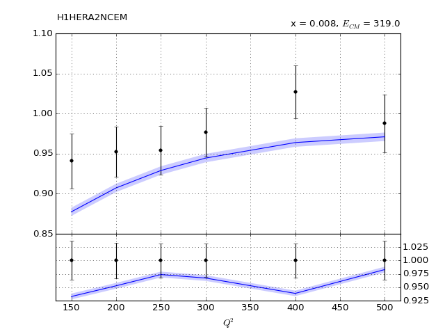](H1HERA2NCEM_13_0.pdf)

[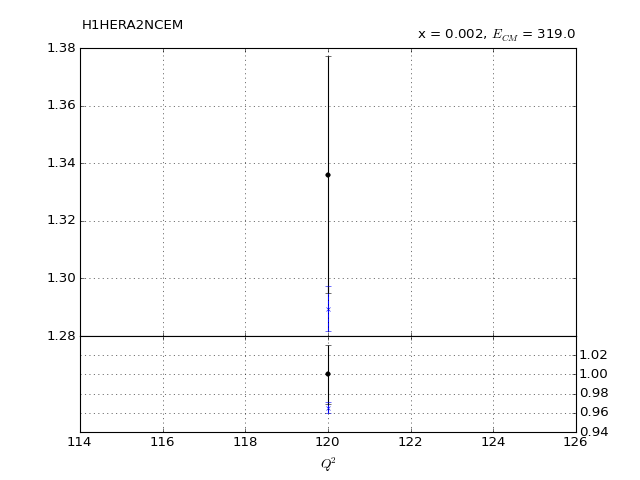](H1HERA2NCEM_16_0.pdf)
[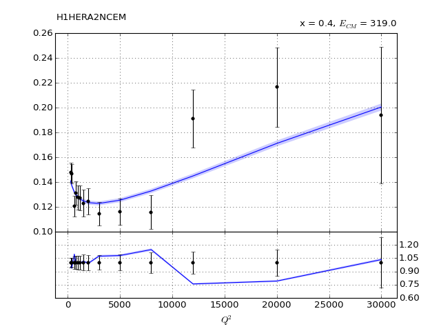](H1HERA2NCEM_1_0.pdf)
[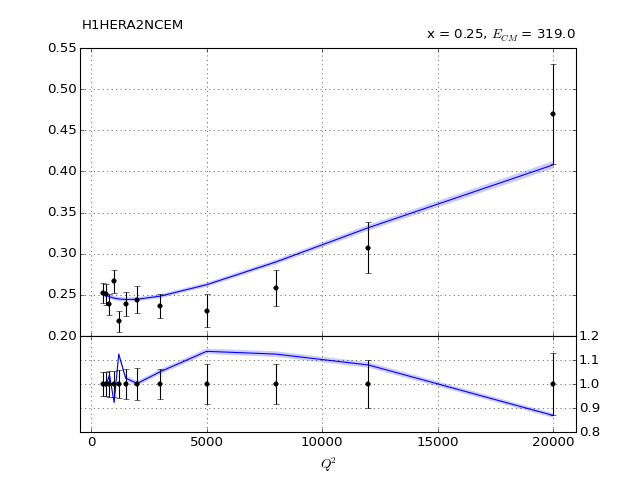](H1HERA2NCEM_2_0.pdf)
[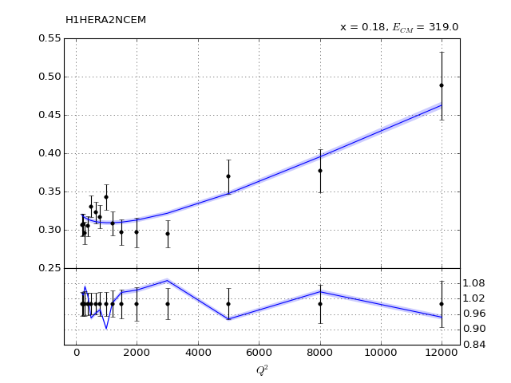](H1HERA2NCEM_3_0.pdf)
[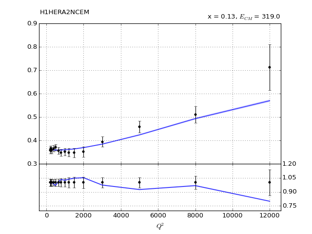](H1HERA2NCEM_4_0.pdf)
[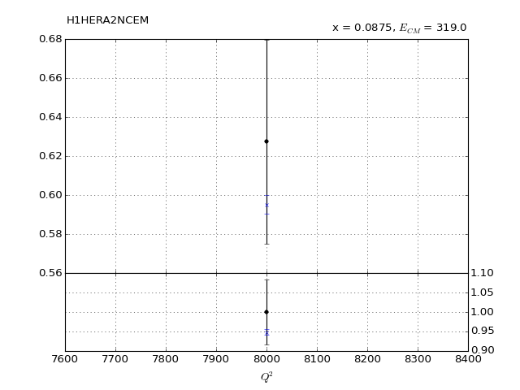](H1HERA2NCEM_5_0.pdf)
[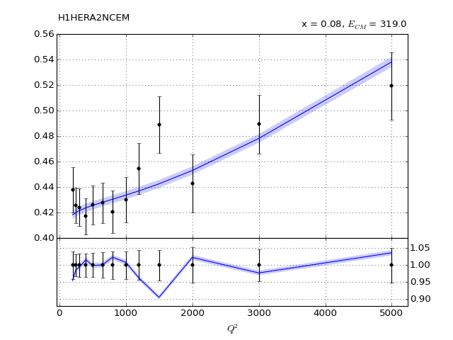](H1HERA2NCEM_6_0.pdf)

[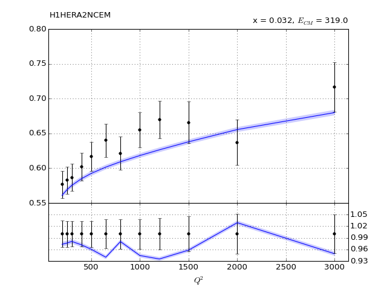](H1HERA2NCEM_9_0.pdf)
      
[Return to Index](../index.html)

------------- 
