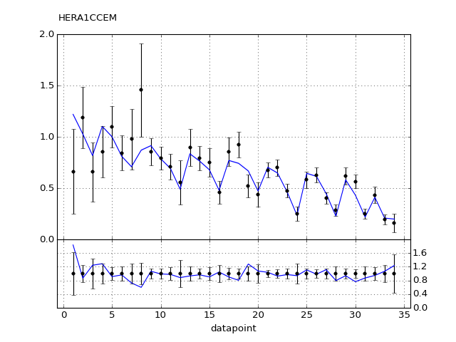
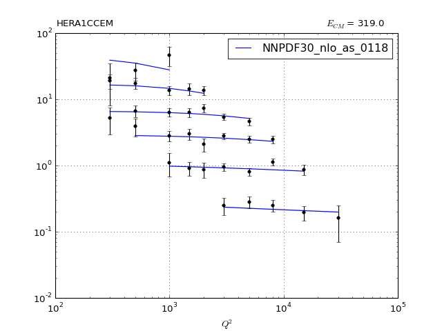
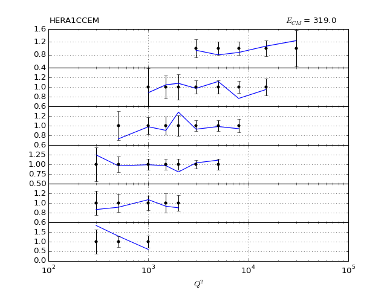
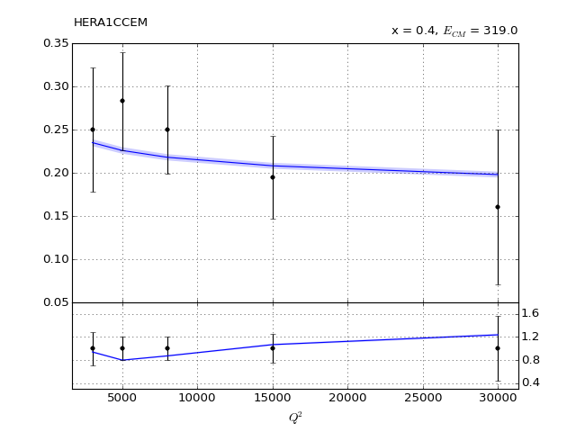
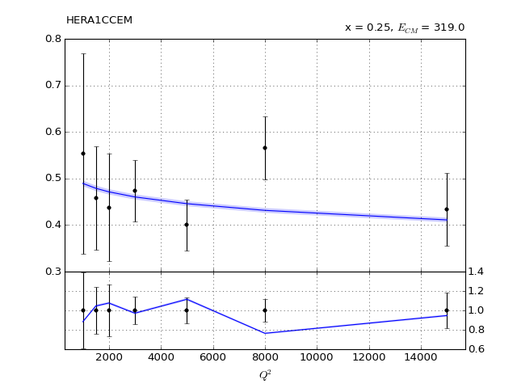
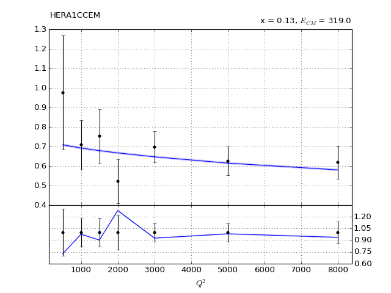
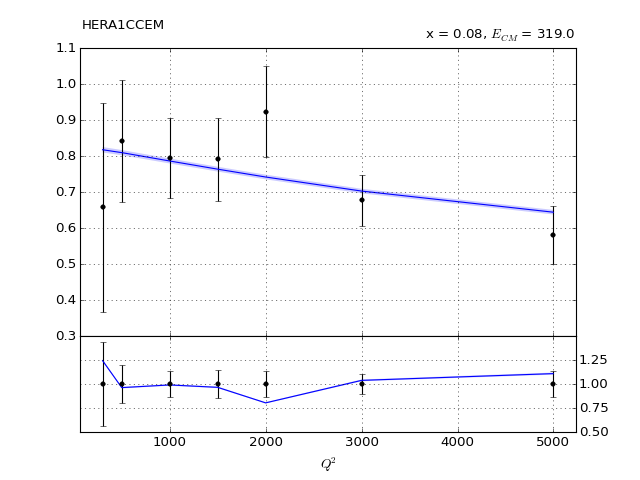
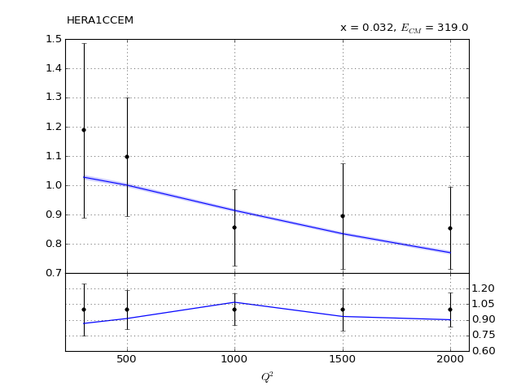
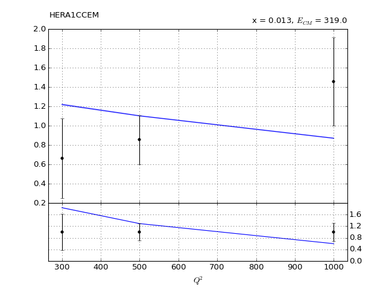

HERA1CCEM
=========
#### Plot vs Datapoint 
 

[Return to Index](../index.html)

------------- 
#### Plot vs Kinematics (collated bins) 
###### n.b bins are scaled by a factor of 2^i where i is the bin index  

      
[Return to Index](../index.html)

------------- 
#### Ratio plot vs Kinematics (collated bins) 

      
[Return to Index](../index.html)

------------- 
#### Plot vs Kinematics (individual bins) 

      
[Return to Index](../index.html)

------------- 
