HERA1NCEM
=========
#### Plot vs Datapoint 
[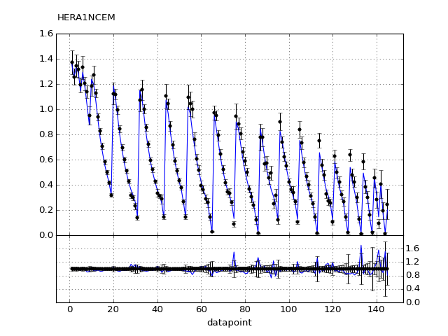](HERA1NCEM.pdf) 

[Return to Index](../index.html)

------------- 
#### Plot vs Kinematics (collated bins) 
###### n.b bins are scaled by a factor of 2^i where i is the bin index  
[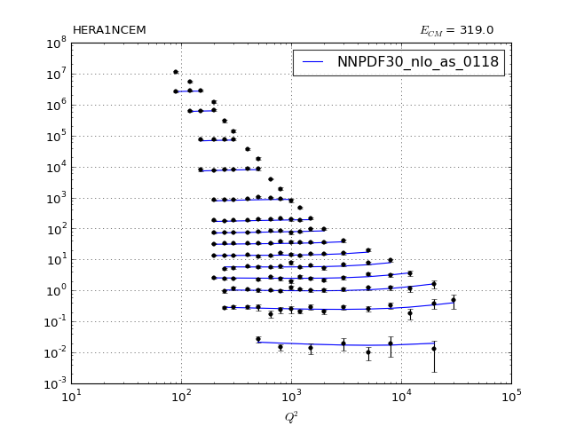](HERA1NCEM_0.pdf)
      
[Return to Index](../index.html)

------------- 
#### Ratio plot vs Kinematics (collated bins) 
[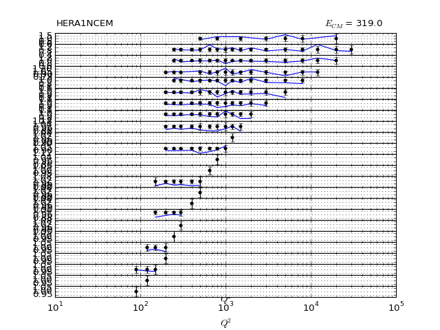](HERA1NCEM_0_R.pdf)
      
[Return to Index](../index.html)

------------- 
#### Plot vs Kinematics (individual bins) 

[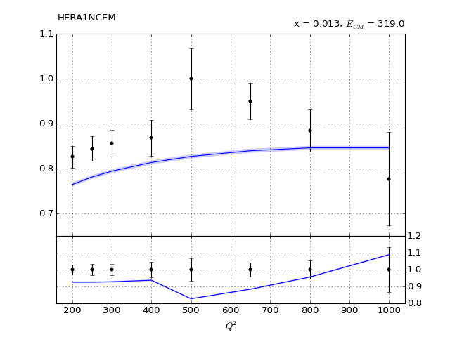](HERA1NCEM_10_0.pdf)
[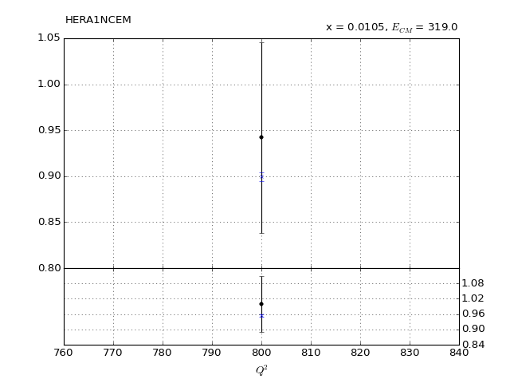](HERA1NCEM_11_0.pdf)
[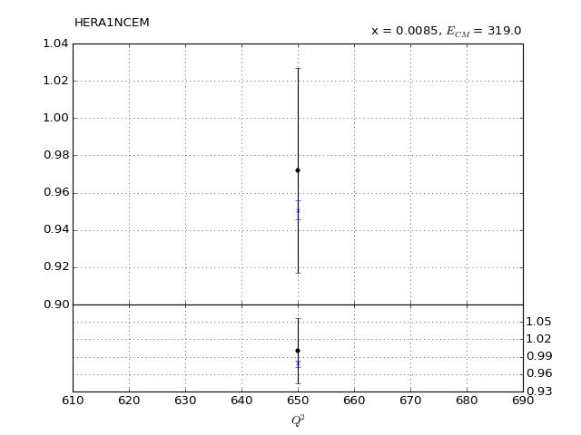](HERA1NCEM_12_0.pdf)

[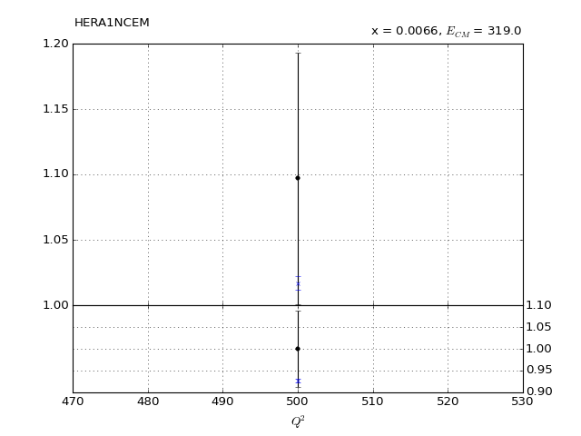](HERA1NCEM_14_0.pdf)
[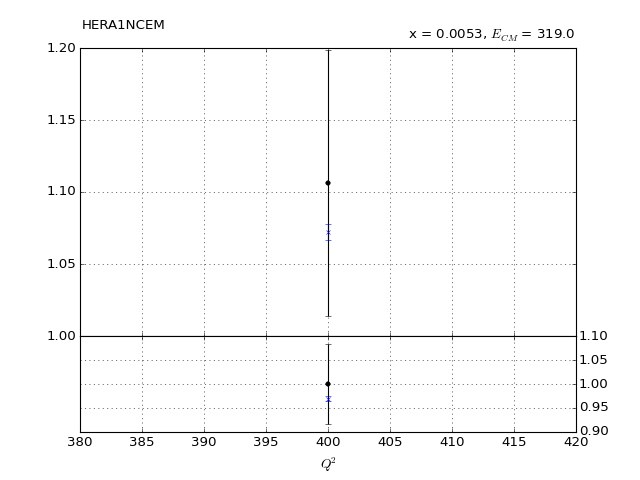](HERA1NCEM_15_0.pdf)
[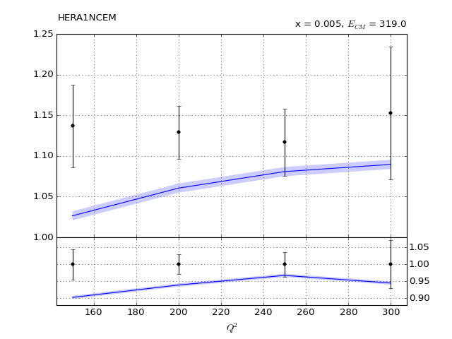](HERA1NCEM_16_0.pdf)
[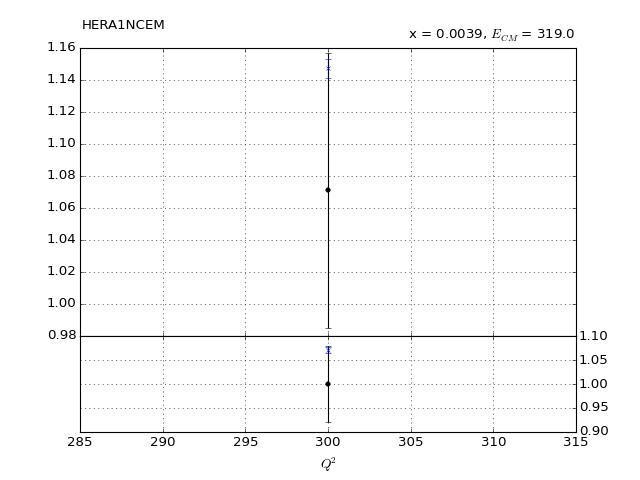](HERA1NCEM_17_0.pdf)

[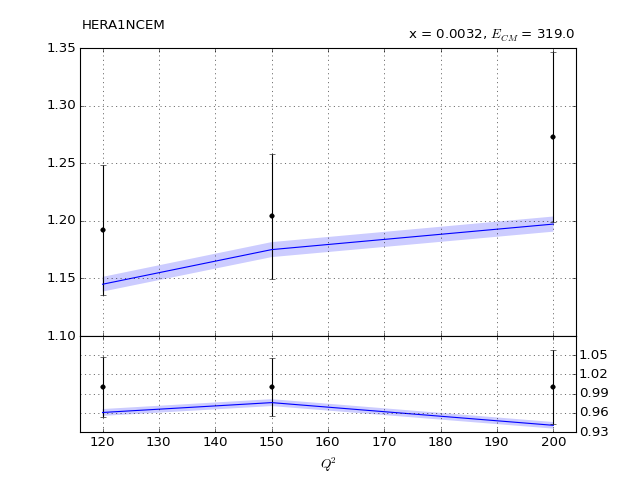](HERA1NCEM_19_0.pdf)
[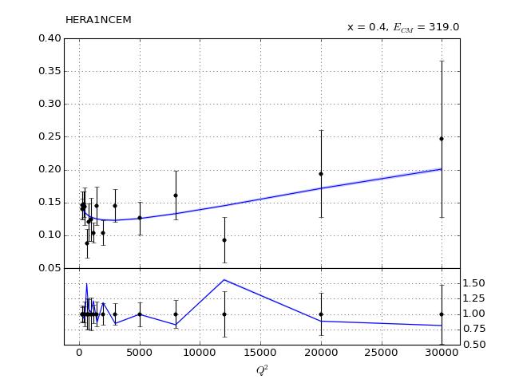](HERA1NCEM_1_0.pdf)
[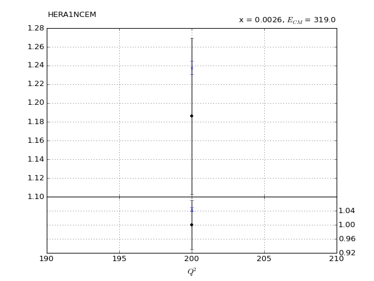](HERA1NCEM_20_0.pdf)
[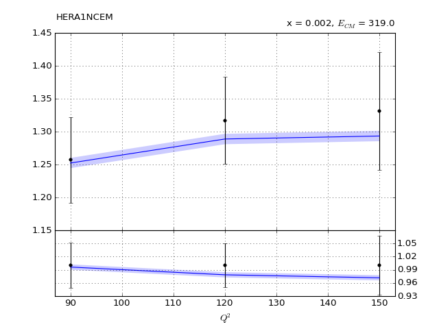](HERA1NCEM_21_0.pdf)
[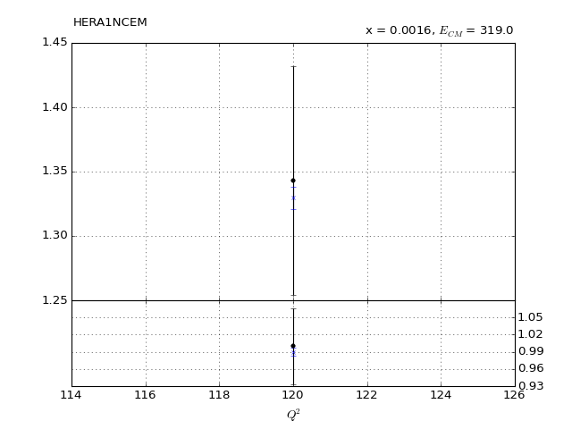](HERA1NCEM_22_0.pdf)
[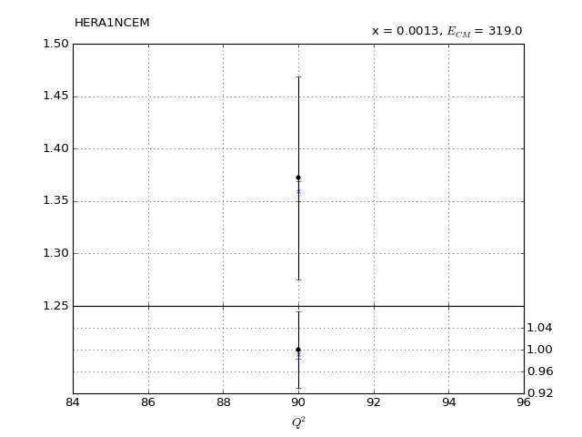](HERA1NCEM_23_0.pdf)
[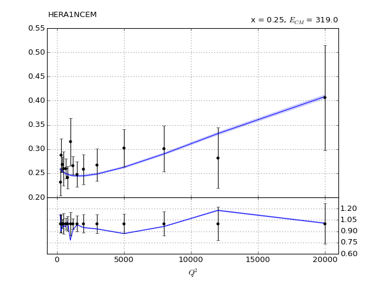](HERA1NCEM_2_0.pdf)
[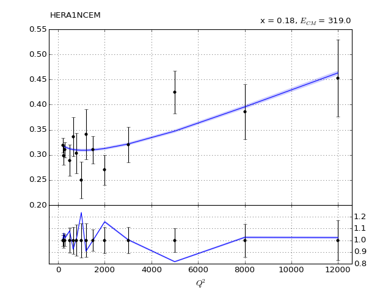](HERA1NCEM_3_0.pdf)
[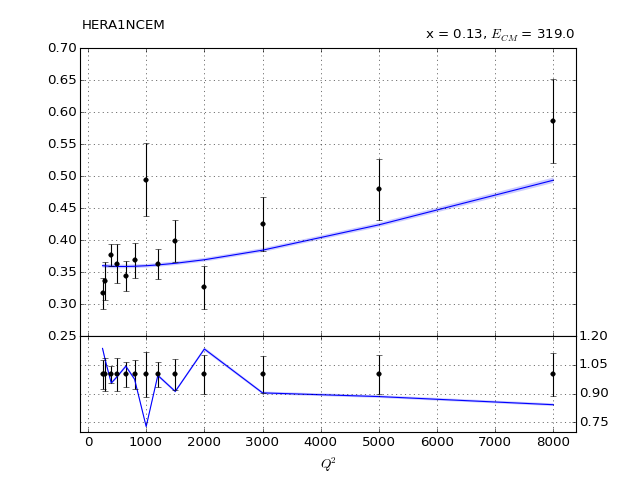](HERA1NCEM_4_0.pdf)
[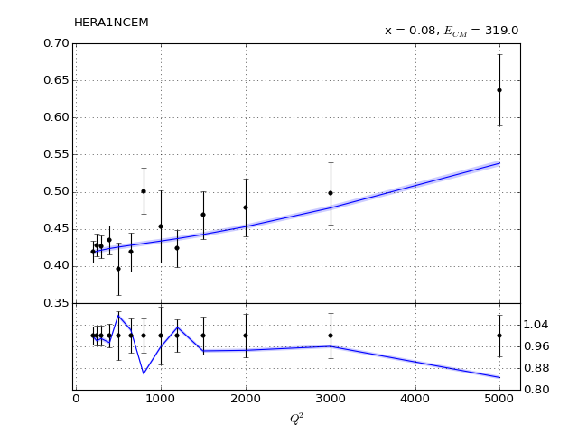](HERA1NCEM_5_0.pdf)
[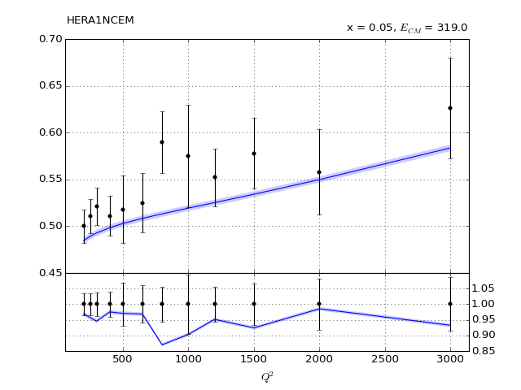](HERA1NCEM_6_0.pdf)
[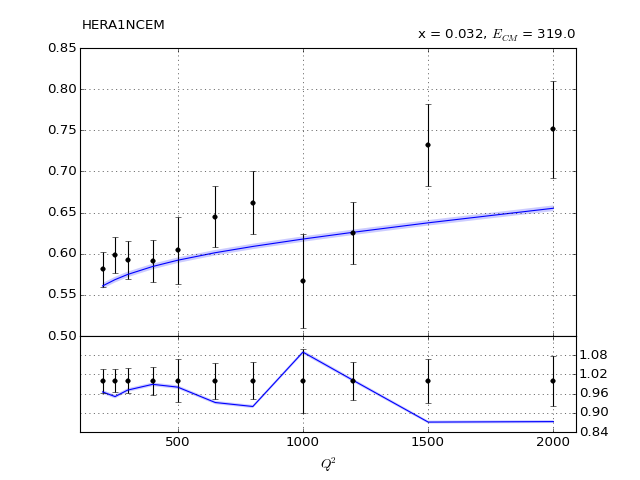](HERA1NCEM_7_0.pdf)
[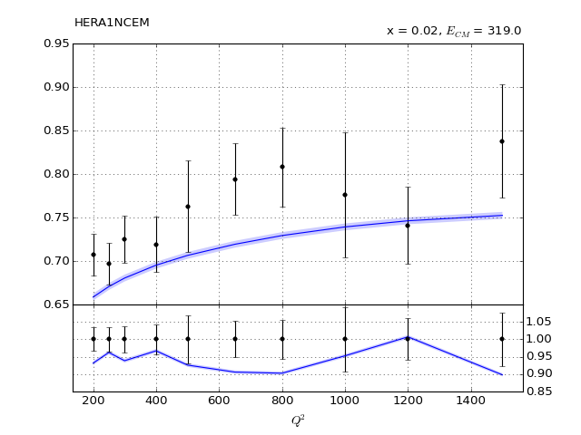](HERA1NCEM_8_0.pdf)
[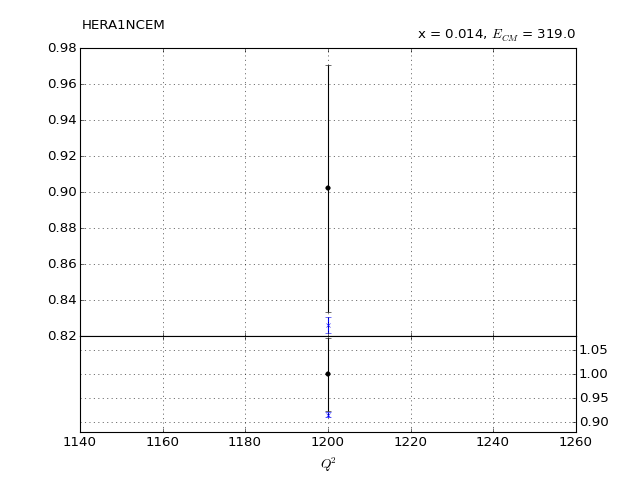](HERA1NCEM_9_0.pdf)
      
[Return to Index](../index.html)

------------- 
