NTVNBDMN
========
#### Plot vs Datapoint 
 

[Return to Index](../index.html)

------------- 
#### Plot vs Kinematics (collated bins) 
###### n.b bins are scaled by a factor of 2^i where i is the bin index  
[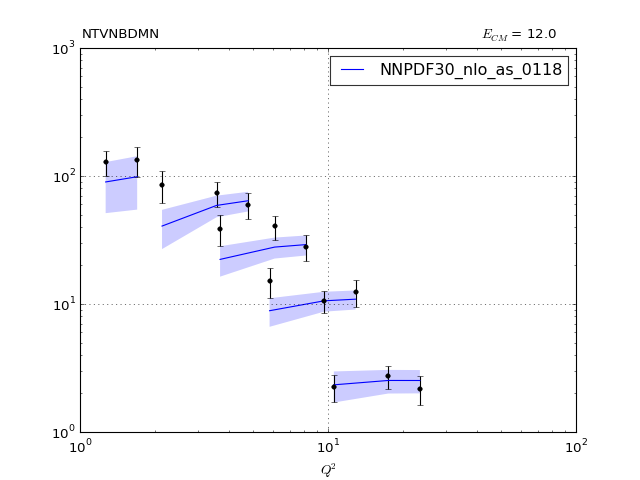](NTVNBDMN_0.pdf)
[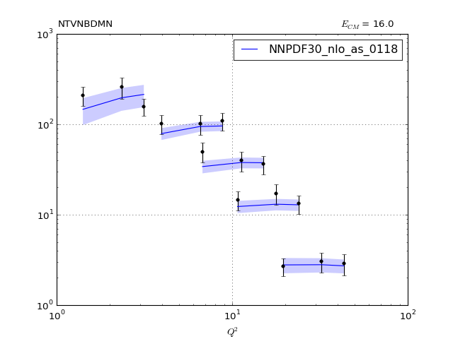](NTVNBDMN_1.pdf)
[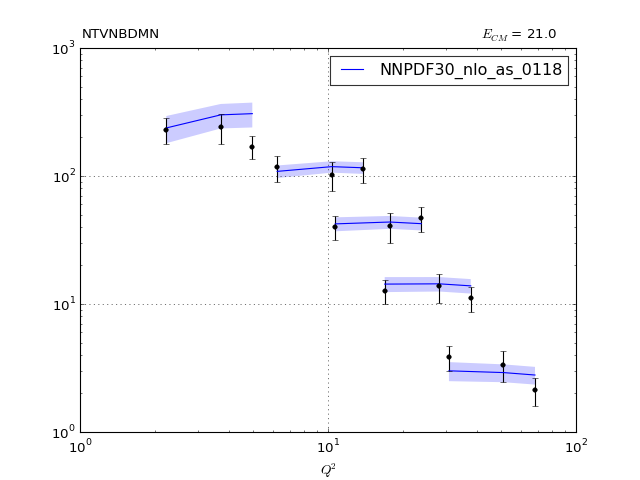](NTVNBDMN_2.pdf)
      
[Return to Index](../index.html)

------------- 
#### Ratio plot vs Kinematics (collated bins) 
[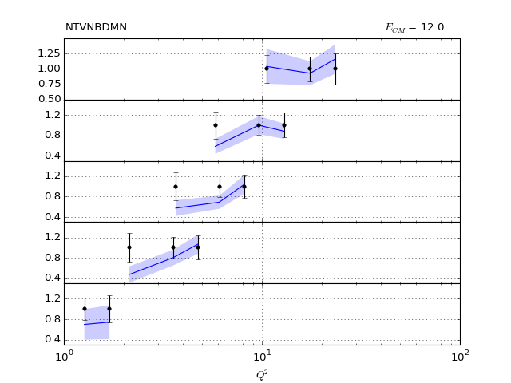](NTVNBDMN_0_R.pdf)
[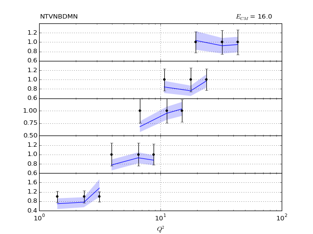](NTVNBDMN_1_R.pdf)
[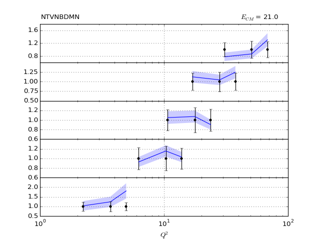](NTVNBDMN_2_R.pdf)
      
[Return to Index](../index.html)

------------- 
#### Plot vs Kinematics (individual bins) 
[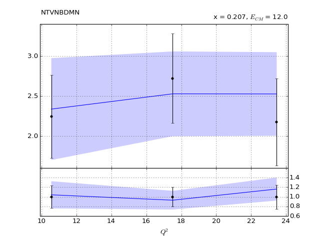](NTVNBDMN_0_0.pdf)
[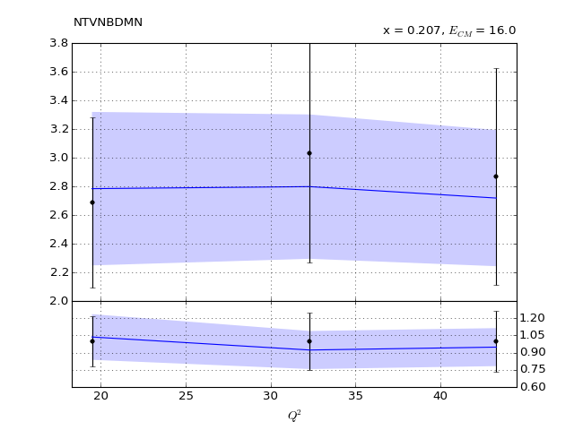](NTVNBDMN_0_1.pdf)
[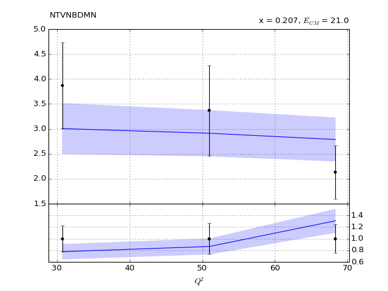](NTVNBDMN_0_2.pdf)
[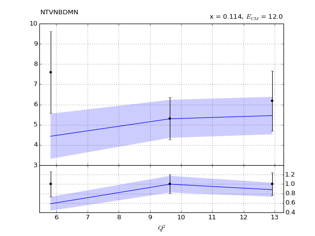](NTVNBDMN_1_0.pdf)
[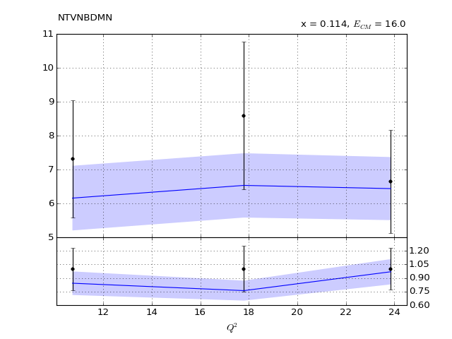](NTVNBDMN_1_1.pdf)
[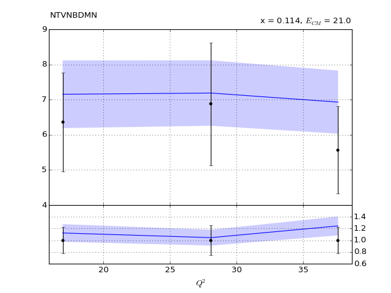](NTVNBDMN_1_2.pdf)
[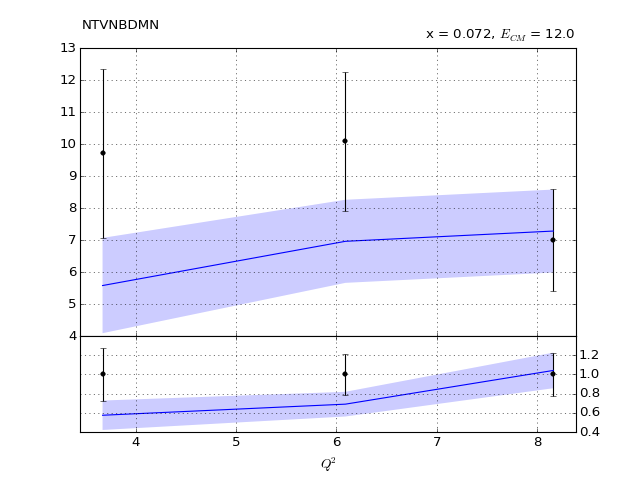](NTVNBDMN_2_0.pdf)

[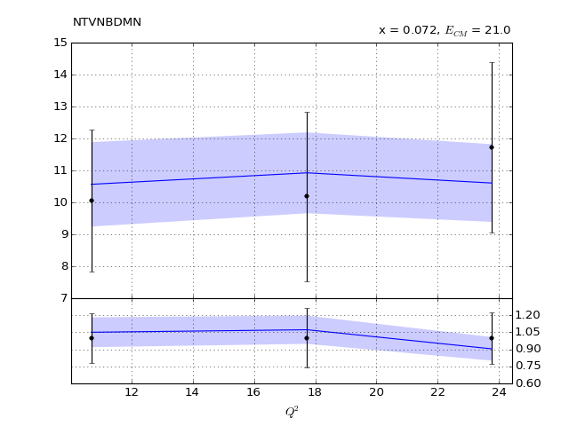](NTVNBDMN_2_2.pdf)
[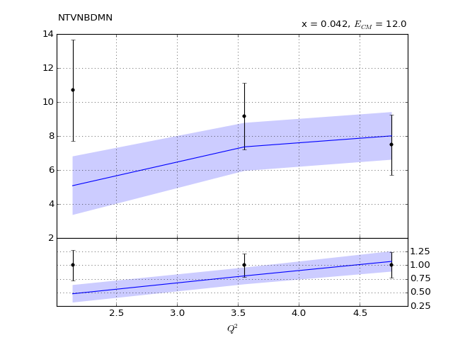](NTVNBDMN_3_0.pdf)
[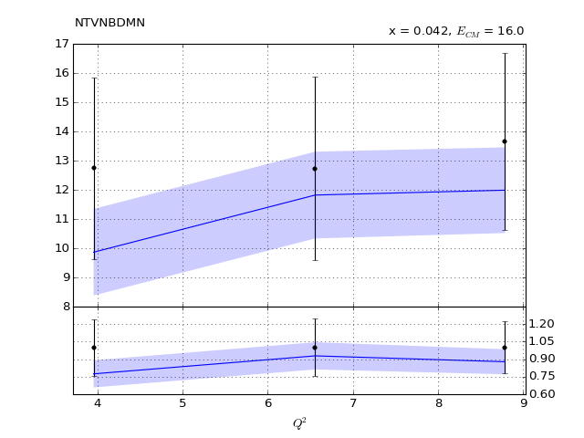](NTVNBDMN_3_1.pdf)
[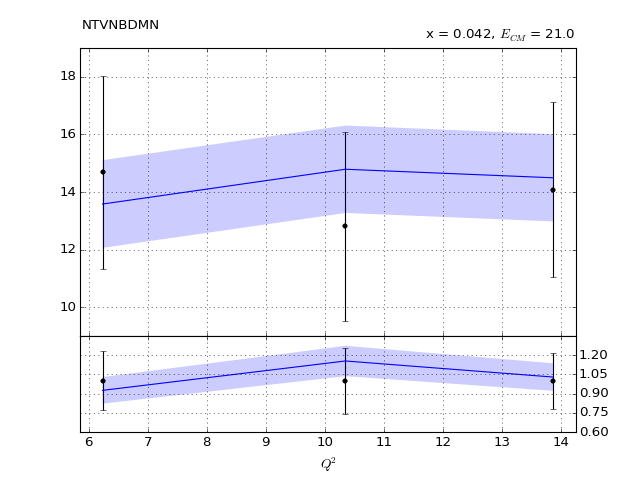](NTVNBDMN_3_2.pdf)
[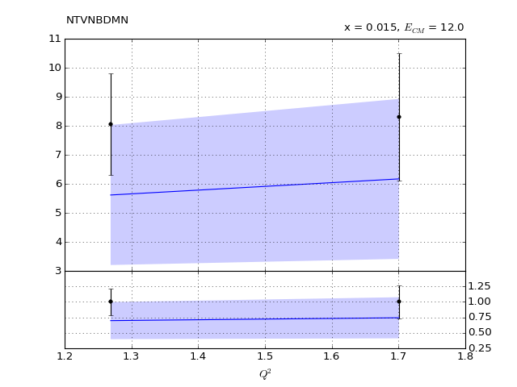](NTVNBDMN_4_0.pdf)
[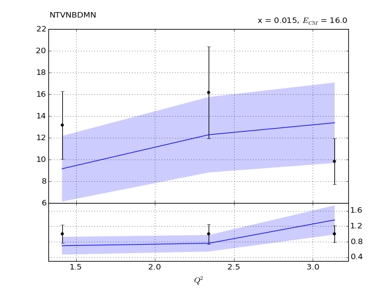](NTVNBDMN_4_1.pdf)
[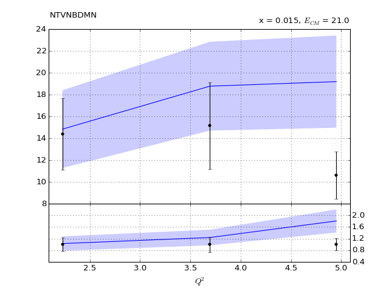](NTVNBDMN_4_2.pdf)
      
[Return to Index](../index.html)

------------- 
