NTVNUDMN
========
#### Plot vs Datapoint 
[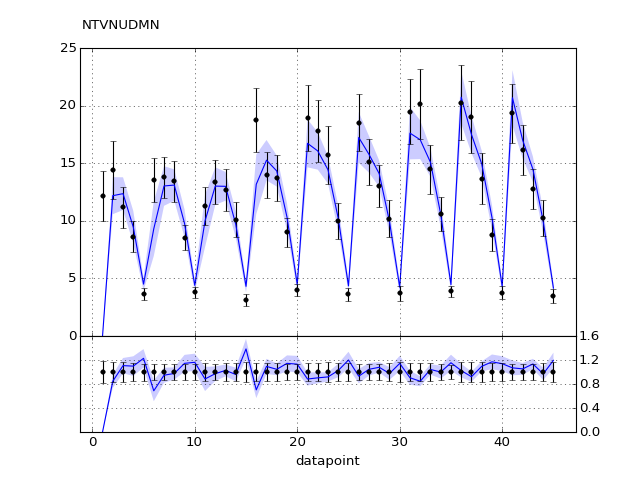](NTVNUDMN.pdf) 

[Return to Index](../index.html)

------------- 
#### Plot vs Kinematics (collated bins) 
###### n.b bins are scaled by a factor of 2^i where i is the bin index  
[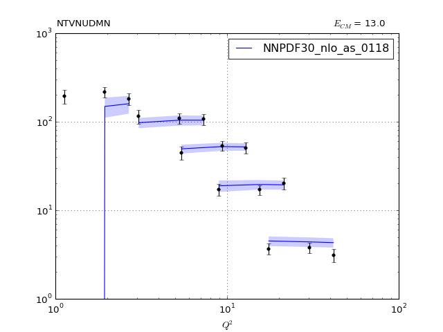](NTVNUDMN_0.pdf)
[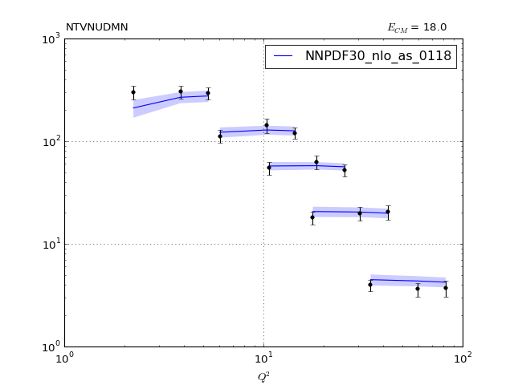](NTVNUDMN_1.pdf)
[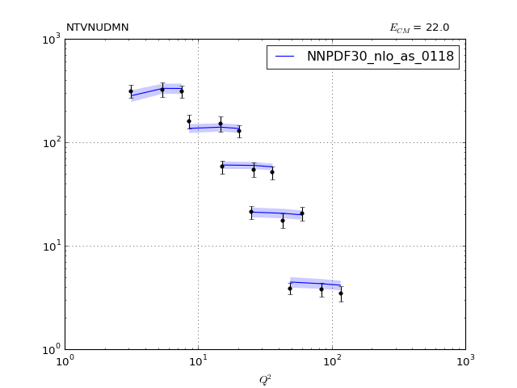](NTVNUDMN_2.pdf)
      
[Return to Index](../index.html)

------------- 
#### Ratio plot vs Kinematics (collated bins) 
[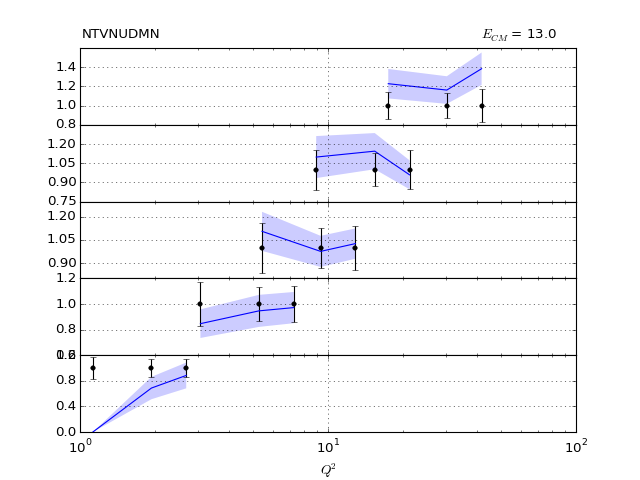](NTVNUDMN_0_R.pdf)
[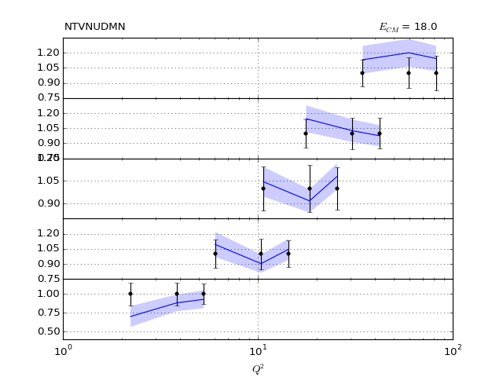](NTVNUDMN_1_R.pdf)
[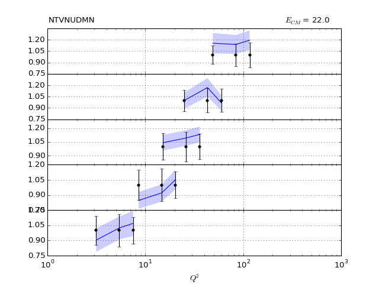](NTVNUDMN_2_R.pdf)
      
[Return to Index](../index.html)

------------- 
#### Plot vs Kinematics (individual bins) 
[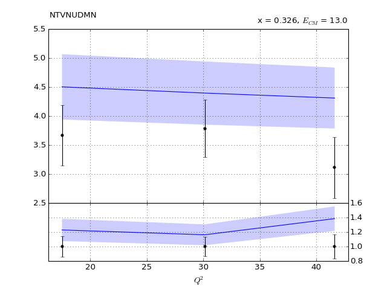](NTVNUDMN_0_0.pdf)
[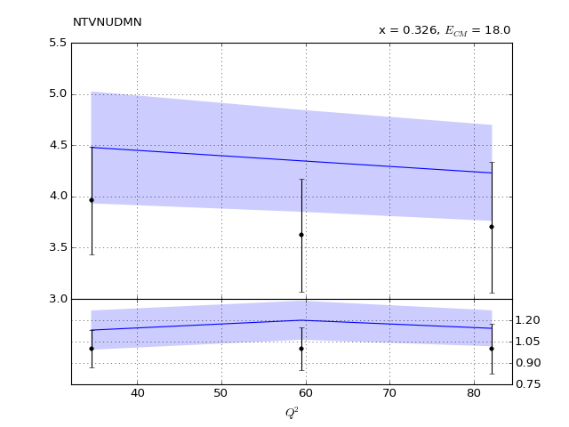](NTVNUDMN_0_1.pdf)

[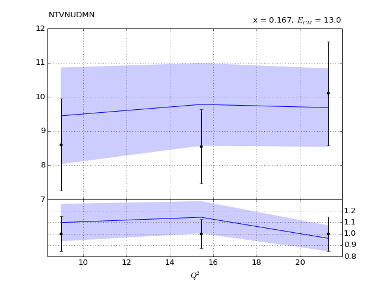](NTVNUDMN_1_0.pdf)
[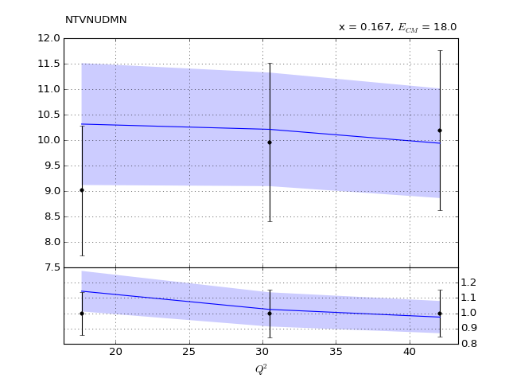](NTVNUDMN_1_1.pdf)
[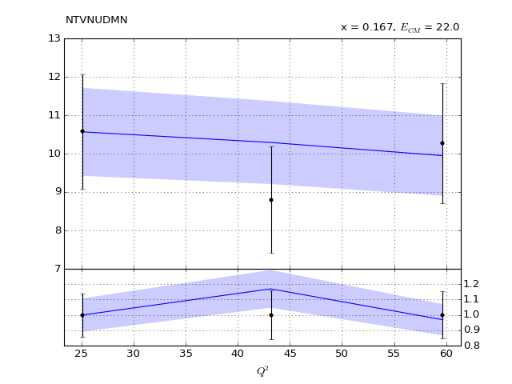](NTVNUDMN_1_2.pdf)
[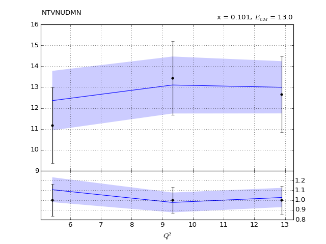](NTVNUDMN_2_0.pdf)
[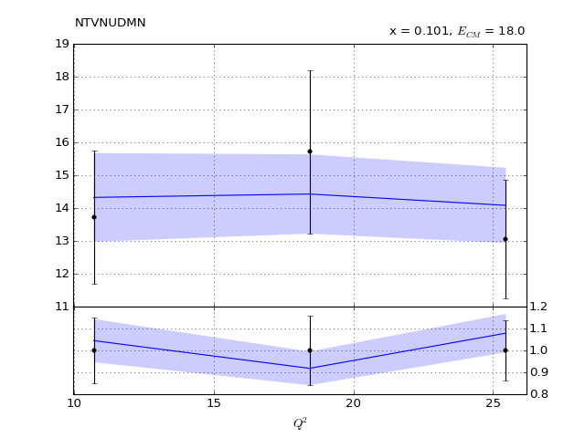](NTVNUDMN_2_1.pdf)
[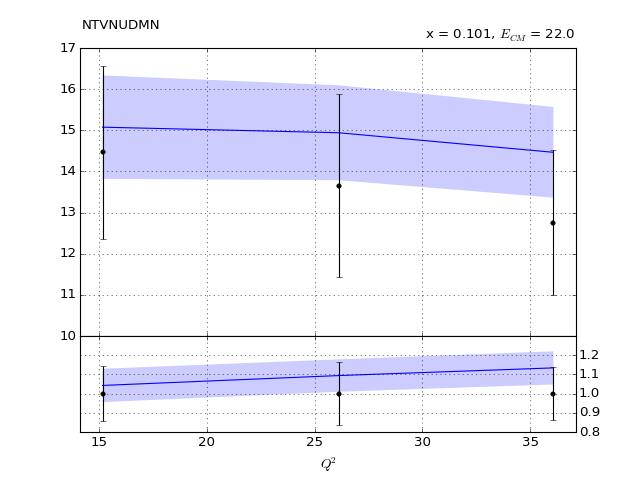](NTVNUDMN_2_2.pdf)
[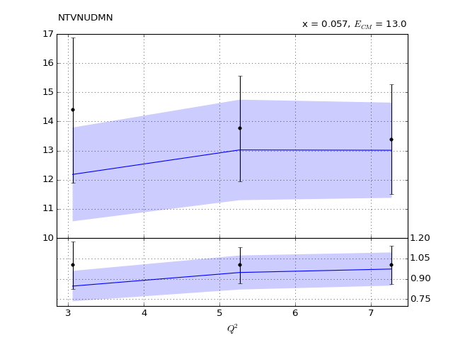](NTVNUDMN_3_0.pdf)
[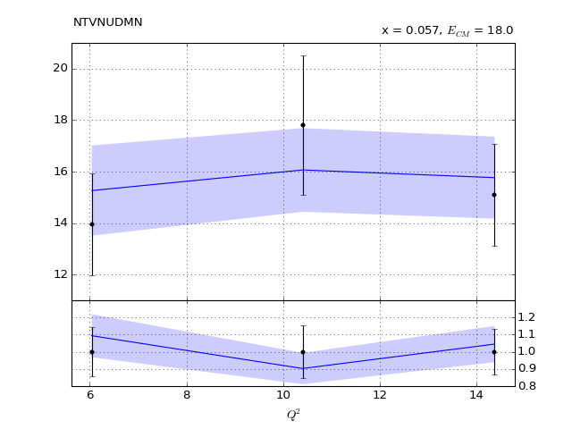](NTVNUDMN_3_1.pdf)

[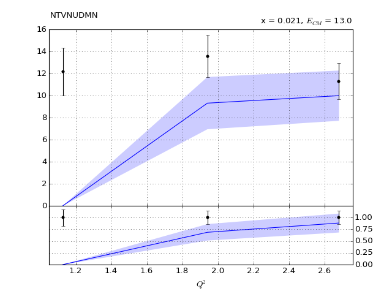](NTVNUDMN_4_0.pdf)
[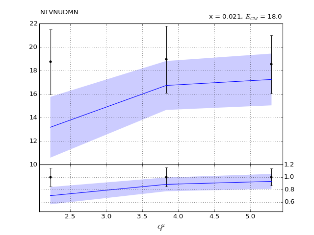](NTVNUDMN_4_1.pdf)
[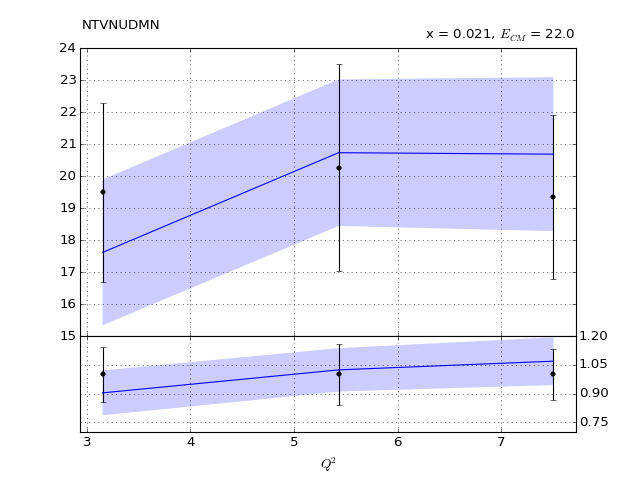](NTVNUDMN_4_2.pdf)
      
[Return to Index](../index.html)

------------- 
