SLACD
=====
#### Plot vs Datapoint 
[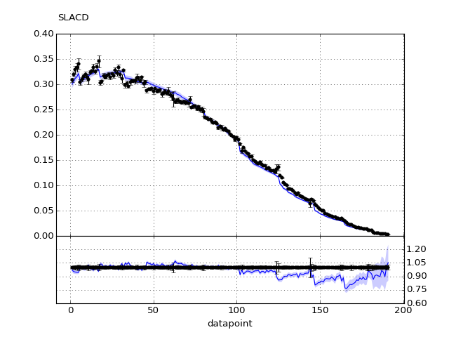](SLACD.pdf) 

[Return to Index](../index.html)

------------- 
#### Plot vs Kinematics (collated bins) 
###### n.b bins are scaled by a factor of 2^i where i is the bin index  
[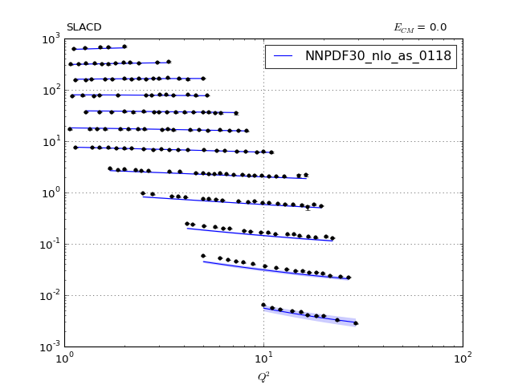](SLACD_0.pdf)
      
[Return to Index](../index.html)

------------- 
#### Ratio plot vs Kinematics (collated bins) 
[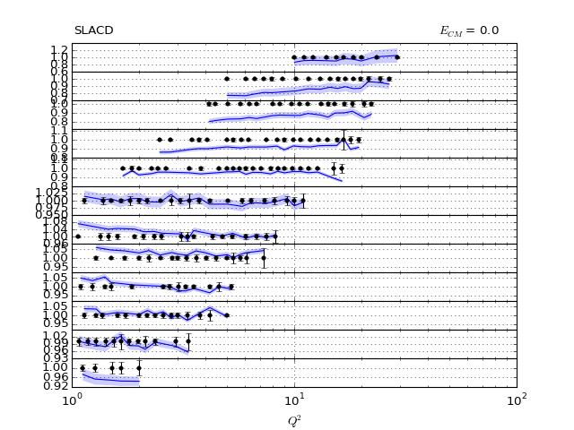](SLACD_0_R.pdf)
      
[Return to Index](../index.html)

------------- 
#### Plot vs Kinematics (individual bins) 
[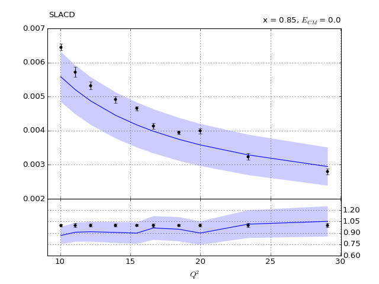](SLACD_0_0.pdf)
[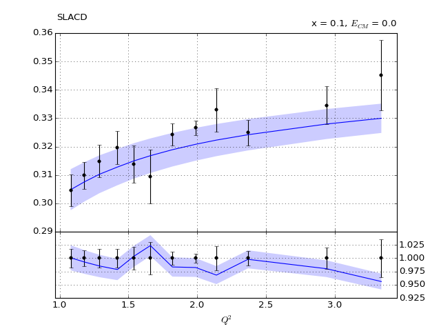](SLACD_10_0.pdf)
[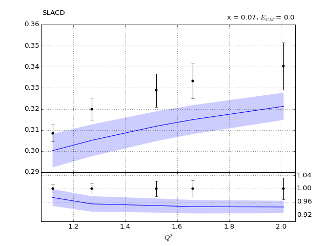](SLACD_11_0.pdf)

[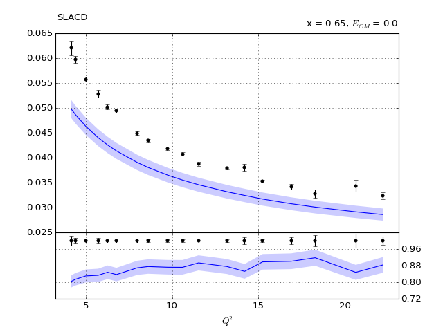](SLACD_2_0.pdf)
[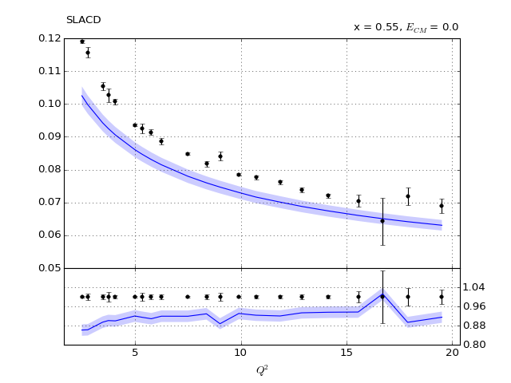](SLACD_3_0.pdf)
[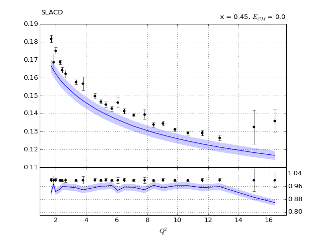](SLACD_4_0.pdf)
[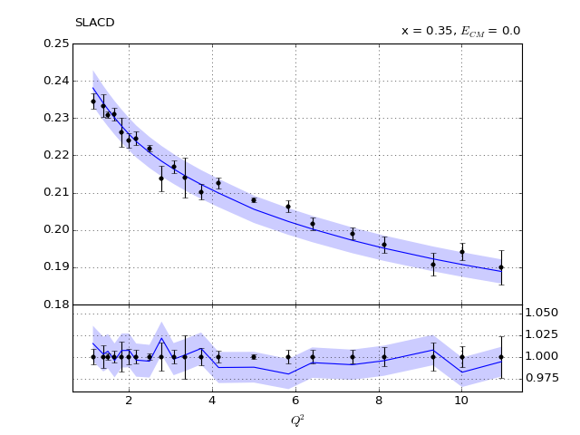](SLACD_5_0.pdf)

[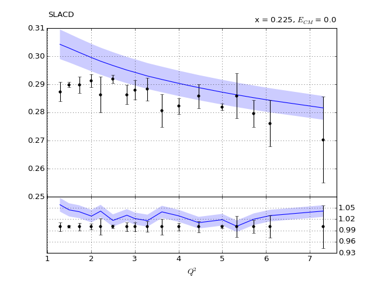](SLACD_7_0.pdf)
[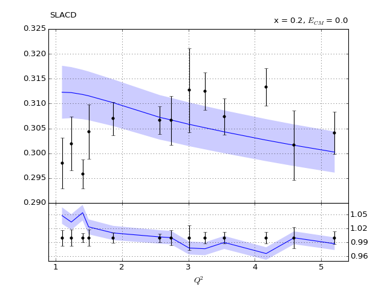](SLACD_8_0.pdf)
[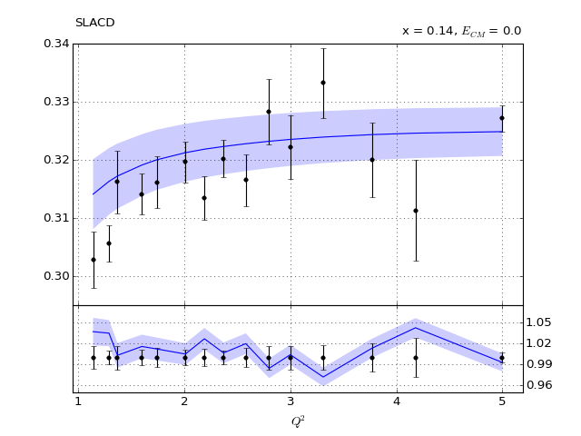](SLACD_9_0.pdf)
      
[Return to Index](../index.html)

------------- 
