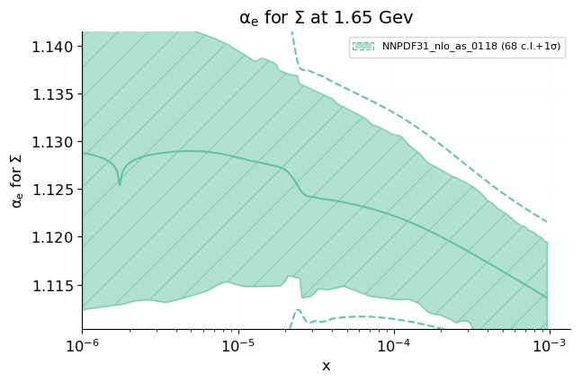 [.pdf](figures/plot_alphaEff_Sigma.pdf)](figures/plot_alphaEff_Sigma.png)

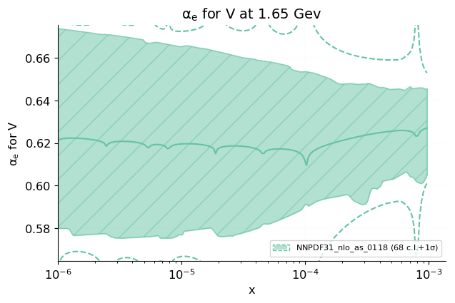 [.pdf](figures/plot_alphaEff_V.pdf)](figures/plot_alphaEff_V.png)

 [.pdf](figures/plot_alphaEff_T3.pdf)](figures/plot_alphaEff_T3.png)

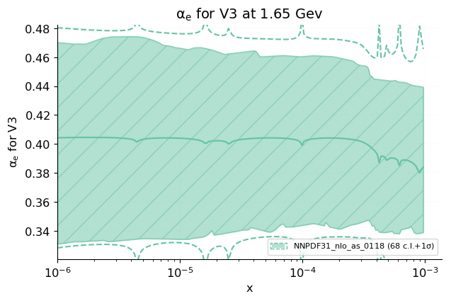 [.pdf](figures/plot_alphaEff_V3.pdf)](figures/plot_alphaEff_V3.png)

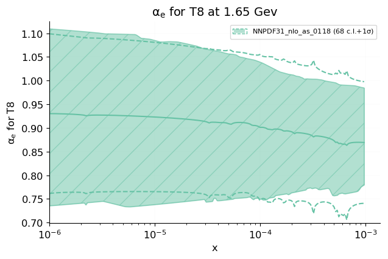 [.pdf](figures/plot_alphaEff_T8.pdf)](figures/plot_alphaEff_T8.png)

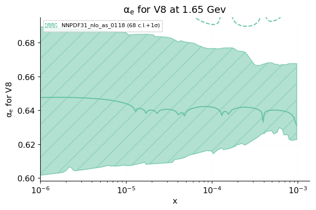 [.pdf](figures/plot_alphaEff_V8.pdf)](figures/plot_alphaEff_V8.png)

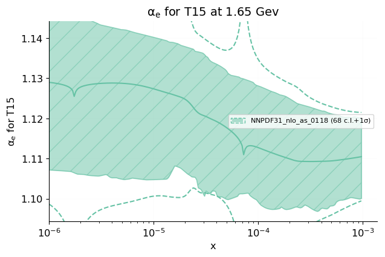 [.pdf](figures/plot_alphaEff_T15.pdf)](figures/plot_alphaEff_T15.png)

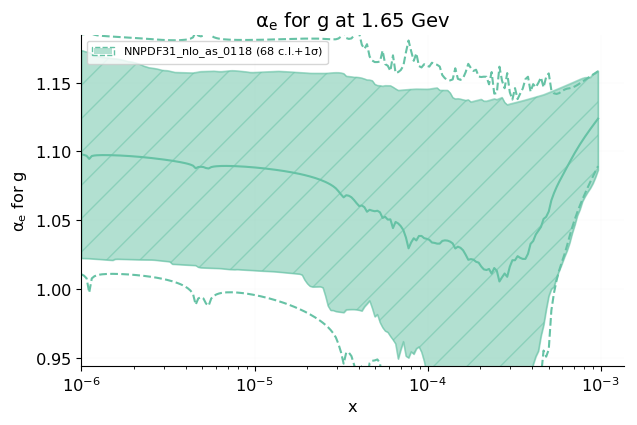 [.pdf](figures/plot_alphaEff_g.pdf)](figures/plot_alphaEff_g.png)

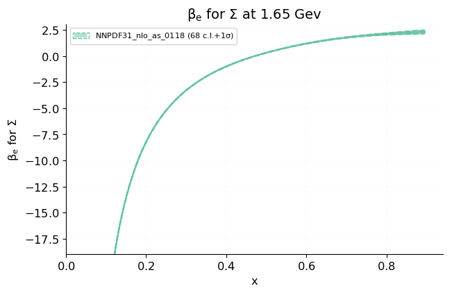 [.pdf](figures/plot_betaEff_Sigma.pdf)](figures/plot_betaEff_Sigma.png)

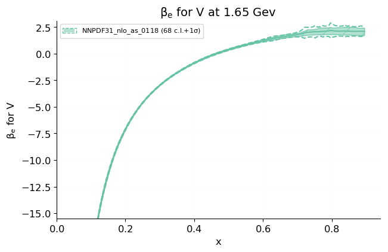 [.pdf](figures/plot_betaEff_V.pdf)](figures/plot_betaEff_V.png)

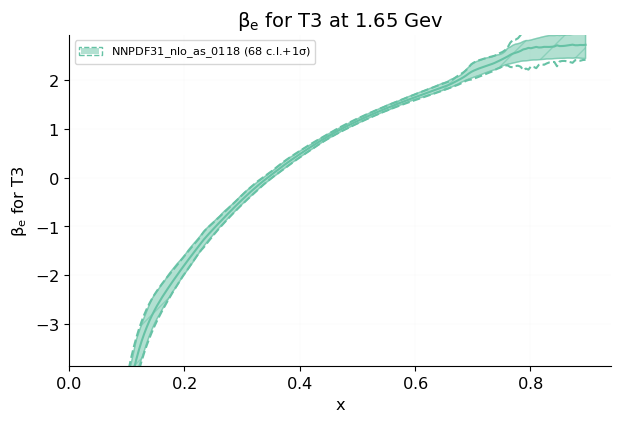 [.pdf](figures/plot_betaEff_T3.pdf)](figures/plot_betaEff_T3.png)

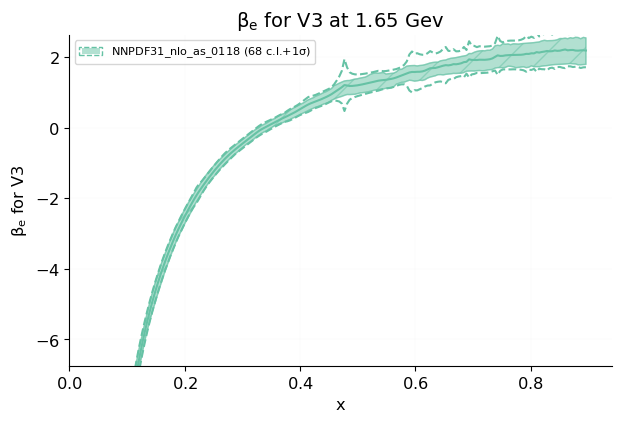 [.pdf](figures/plot_betaEff_V3.pdf)](figures/plot_betaEff_V3.png)

 [.pdf](figures/plot_betaEff_T8.pdf)](figures/plot_betaEff_T8.png)

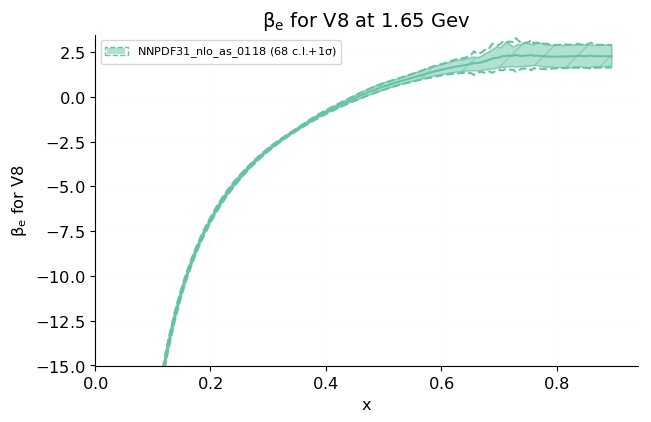 [.pdf](figures/plot_betaEff_V8.pdf)](figures/plot_betaEff_V8.png)

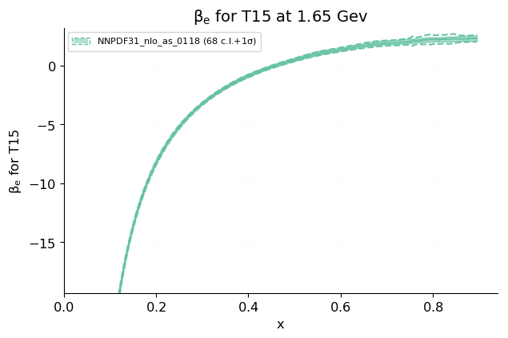 [.pdf](figures/plot_betaEff_T15.pdf)](figures/plot_betaEff_T15.png)

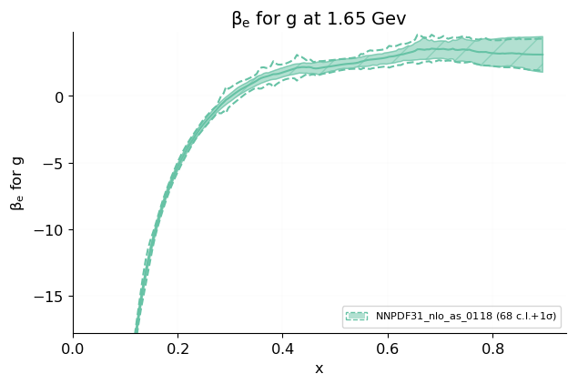 [.pdf](figures/plot_betaEff_g.pdf)](figures/plot_betaEff_g.png)

<table border="0" class="dataframe">
<thead>
<tr style="text-align: right;">
<th></th>
<th>Effective exponent</th>
<th>Min</th>
<th>Max</th>
</tr>
</thead>
<tbody>
<tr>
<th>$\Sigma$</th>
<td>alpha</td>
<td>1.106</td>
<td>1.145</td>
</tr>
<tr>
<th></th>
<td>beta</td>
<td>1.487</td>
<td>2.530</td>
</tr>
<tr>
<th>$V$</th>
<td>alpha</td>
<td>0.5800</td>
<td>0.6740</td>
</tr>
<tr>
<th></th>
<td>beta</td>
<td>1.392</td>
<td>2.383</td>
</tr>
<tr>
<th>$T3$</th>
<td>alpha</td>
<td>2.200E-2</td>
<td>0.9800</td>
</tr>
<tr>
<th></th>
<td>beta</td>
<td>1.796</td>
<td>2.965</td>
</tr>
<tr>
<th>$V3$</th>
<td>alpha</td>
<td>0.3310</td>
<td>0.4700</td>
</tr>
<tr>
<th></th>
<td>beta</td>
<td>1.501</td>
<td>2.544</td>
</tr>
<tr>
<th>$T8$</th>
<td>alpha</td>
<td>0.7360</td>
<td>1.110</td>
</tr>
<tr>
<th></th>
<td>beta</td>
<td>1.553</td>
<td>2.655</td>
</tr>
<tr>
<th>$V8$</th>
<td>alpha</td>
<td>0.6020</td>
<td>0.6900</td>
</tr>
<tr>
<th></th>
<td>beta</td>
<td>1.446</td>
<td>2.978</td>
</tr>
<tr>
<th>$T15$</th>
<td>alpha</td>
<td>1.100</td>
<td>1.146</td>
</tr>
<tr>
<th></th>
<td>beta</td>
<td>1.563</td>
<td>2.604</td>
</tr>
<tr>
<th>$g$</th>
<td>alpha</td>
<td>1.022</td>
<td>1.173</td>
</tr>
<tr>
<th></th>
<td>beta</td>
<td>1.682</td>
<td>4.606</td>
</tr>
</tbody>
</table>