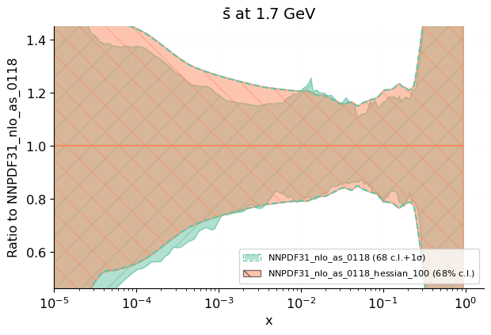
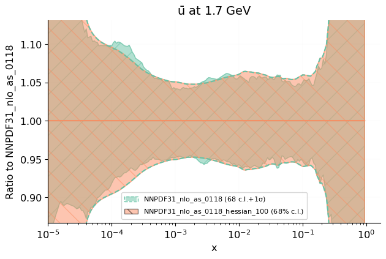
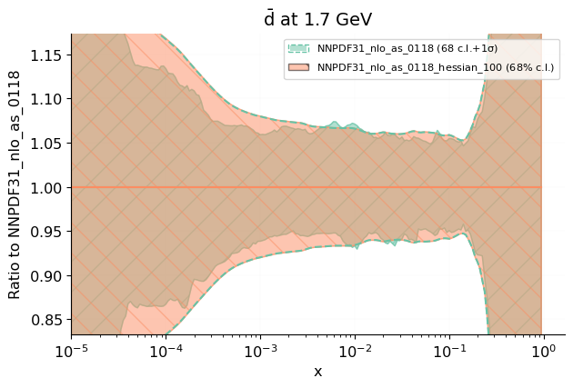
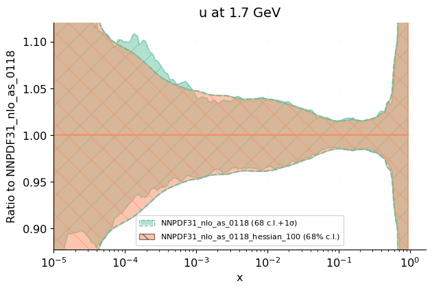
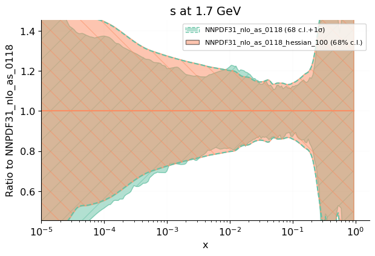
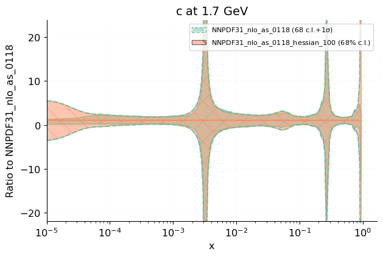

%NNPDF Report for fit deltachi2 

Eigenvector decomposition
------------

 [.pdf](figures/plot_pdfs_bars.pdf) [#](#plot_pdfs_bars)](figures/plot_pdfs_bars.png){#plot_pdfs_bars} 

 [.pdf](figures/plot_pdfs_baru.pdf) [#](#plot_pdfs_baru)](figures/plot_pdfs_baru.png){#plot_pdfs_baru} 

 [.pdf](figures/plot_pdfs_bard.pdf) [#](#plot_pdfs_bard)](figures/plot_pdfs_bard.png){#plot_pdfs_bard} 

 [.pdf](figures/plot_pdfs_g.pdf) [#](#plot_pdfs_g)](figures/plot_pdfs_g.png){#plot_pdfs_g} 

 [.pdf](figures/plot_pdfs_d.pdf) [#](#plot_pdfs_d)](figures/plot_pdfs_d.png){#plot_pdfs_d} 

 [.pdf](figures/plot_pdfs_u.pdf) [#](#plot_pdfs_u)](figures/plot_pdfs_u.png){#plot_pdfs_u} 

 [.pdf](figures/plot_pdfs_s.pdf) [#](#plot_pdfs_s)](figures/plot_pdfs_s.png){#plot_pdfs_s} 

 [.pdf](figures/plot_pdfs_c.pdf) [#](#plot_pdfs_c)](figures/plot_pdfs_c.png){#plot_pdfs_c} 

